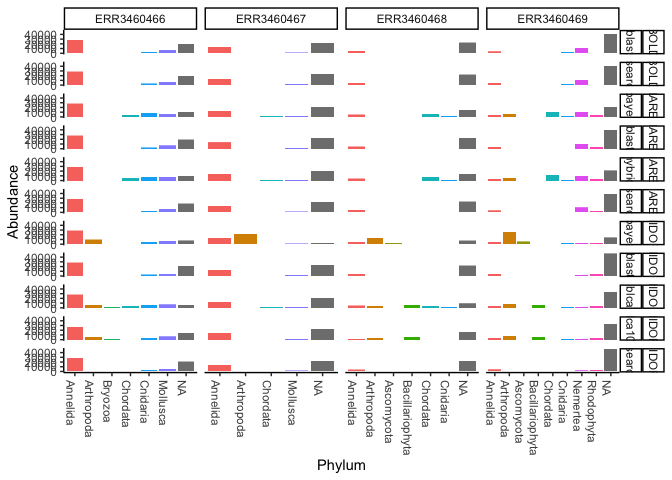
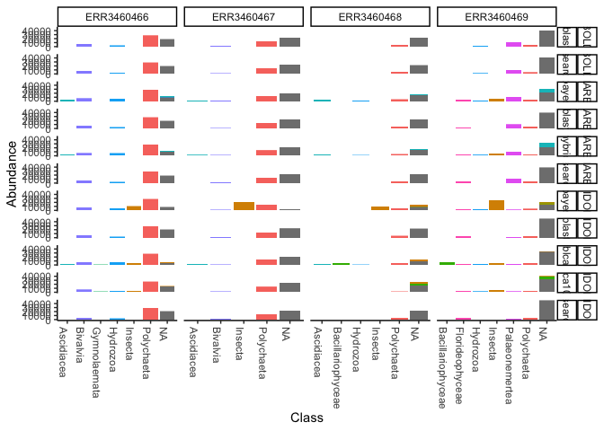
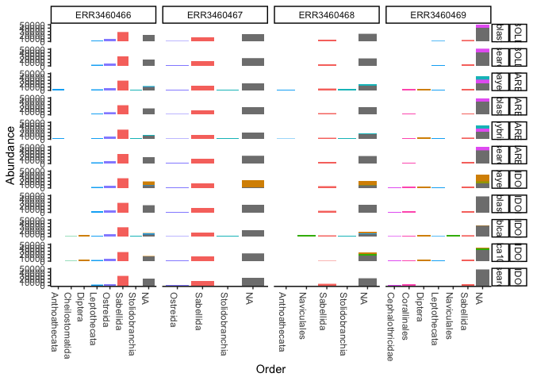
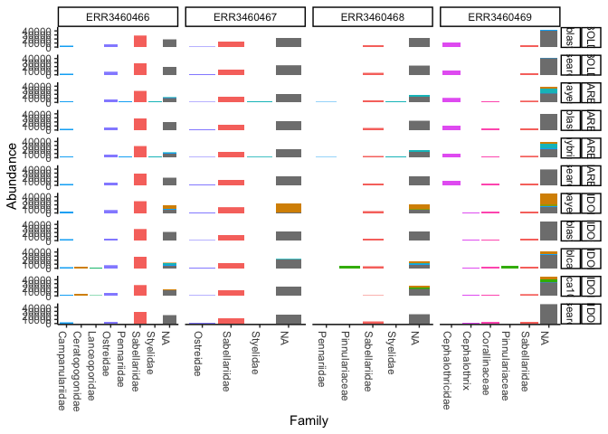

Testing\_bioinformatics\_parameters
================
Saara Suominen
5/7/2021


# Testing parameters of the bioinformatic pipelines

In this document there are the notes of comparing different parameters of bioinformatics pipelines. Each step was run manually (not as a pipeline), to assist in deciding what steps should be included in the PacMAN bioinformatics pipeline.

Table of Contents
=================

  * [1. Trimmomatic](#trimmomatic)
  * [2. CutAdapt](#cutAdapt)
  * [3. Figaro](#figaro)
  * [4. Dada2](#dada2)
    - [4.1. Running the pipeline](#running-the-pipeline)
  * [5. Comparing the results](#comparing-the-results)
  * [6. Taxonomic assignment](#taxonomic-assignment)
    - [6.1. Qiime formatted reference datasets](#qiime-formatted-reference-datasets)
    - [6.2. Qiime import of dada2 data](#qiime-import-of-dada2-data:)
    - [6.3. BLAST](#blast)
    - [6.4. Naive Bayesian](#naive-bayesian)
    - [6.5. VSEARCH](#vsearch)
    - [6.6. hybrid](#hybrid)
  * [7. Data output for viewing](#data-output-for-viewing)
  * [8. Taxonomic classification of results](#taxonomic-classification-of-results)

[When comparing different publicly available bioinformatics pipelines](https://github.com/iobis/pacman/blob/main/BioinformaticsPipeline/Testing_bioinformatics_pipelines.md) on 4 samples of the ARMS project, we arrived at different results in terms of the number of reads and ASVs, as well as taxonomic assignments. To understand why this was happening, we manually compared different parameters used in the bioinformatics pipelines at each step.

The first step was to compare the performance of the dada2 pipeline. We tested two different preprocessing steps with three different dada2 configurations, based on what the publicly available pipelines were recommending, and what was being used in literature.

* **1st step: trimmomatic**
 a. Only adapter Trimming
 b. With stringent quality filtering (as used by the ARMS project and PEMA pipeline)
 c. No trimming (raw data to dada2, as is used in tourmaline)

* **Second step: cutAdapt**
  a. Cut adapters in all cases

* **Third step: dada2-filterandTrim**
 a. Using only a length filter (truncLEN)
 b. Using only a quality filter
 c. Filtering based in both length and quality

Therefore ultimately we trialed 9 different analyses:

1.	Raw data -> dada2-truncLen (onlyLength)
2.	Raw data -> dada2-Anacapa (onlyQuality)
3.	Raw data -> dada2-Tagseq (both length and quality)
4.	Adaptersonly -> dada2-truncLen (onlyLength)
5.	Adaptersonly -> dada2-Anacapa (onlyQuality)
6.	Adaptersonly -> dada2-Tagseq (both length and quality)
7.	Pema (quality trimming) -> dada2-truncLen (onlyLength)
8.	Pema (quality trimming) -> dada2-Anacapa (onlyQuality)
9.	Pema (quality trimming) -> dada2-Tagseq (both length and quality)

Before and after adapter and primer removal we looked at the profiles of the reads with fastqc.
The sequences have some problems. After trimming they look somewhat better, but there is still a strange GC profile, and plenty of overrepresented sequences. This could point to community with one highly abundant member.

[QC on raw reads shows that there are many quality problems](https://github.com/iobis/pacman/blob/main/BioinformaticsPipeline/Preprocessing_trials_docs/raw_multiqc.html)


In the following sections are the commands used for each step:

## 1. Trimmomatic

PEMA parameters : ILLUMINACLIP:NexteraPE-PE.fa:2:30:15 MAXINFO:200:0.3 LEADING:10 TRAILING:15
```
trimmomatic PE ./ARMS-COI-14_S135_L001_R1_001.fastq.gz ./ARMS-COI-14_S135_L001_R2_001.fastq.gz  -baseout ../trimmomatic/pema/ARMS-COI-14  ILLUMINACLIP:NexteraPE-PE.fa:2:30:15 MAXINFO:200:0.3 LEADING:10 TRAILING:15
trimmomatic PE ./ARMS-COI-15_S152_L001_R1_001.fastq.gz ./ARMS-COI-15_S152_L001_R2_001.fastq.gz  -baseout ../trimmomatic/pema/ARMS-COI-15  ILLUMINACLIP:NexteraPE-PE.fa:2:30:15 MAXINFO:200:0.3 LEADING:10 TRAILING:15
trimmomatic PE ./ARMS-COI-16_S169_L001_R1_001.fastq.gz ./ARMS-COI-16_S169_L001_R2_001.fastq.gz  -baseout ../trimmomatic/pema/ARMS-COI-16  ILLUMINACLIP:NexteraPE-PE.fa:2:30:15 MAXINFO:200:0.3 LEADING:10 TRAILING:15
trimmomatic PE ./ARMS-COI-17_S186_L001_R1_001.fastq.gz ./ARMS-COI-17_S186_L001_R2_001.fastq.gz  -baseout ../trimmomatic/pema/ARMS-COI-17  ILLUMINACLIP:NexteraPE-PE.fa:2:30:15 MAXINFO:200:0.3 LEADING:10 TRAILING:15
```
[Here is the multiqc of all paired reads after trimming.](https://github.com/iobis/pacman/blob/main/BioinformaticsPipeline/Preprocessing_trials_docs/trim_pema_multiqc_report_paired.html)
[And here is of the unpaired reads](https://github.com/iobis/pacman/blob/main/BioinformaticsPipeline/Preprocessing_trials_docs/trim_pema_multiqc_report_unpaired.html)

Removing only adapters: ILLUMINACLIP:NexteraPE-PE.fa:2:30:10
```
trimmomatic PE ./ARMS-COI-14_S135_L001_R1_001.fastq.gz ./ARMS-COI-14_S135_L001_R2_001.fastq.gz  -baseout ../trimmomatic/adaptersonly/ARMS-COI-14  ILLUMINACLIP:NexteraPE-PE.fa:2:30:10
trimmomatic PE ./ARMS-COI-15_S152_L001_R1_001.fastq.gz ./ARMS-COI-15_S152_L001_R2_001.fastq.gz  -baseout ../trimmomatic/adaptersonly/ARMS-COI-15  ILLUMINACLIP:NexteraPE-PE.fa:2:30:10
trimmomatic PE ./ARMS-COI-16_S169_L001_R1_001.fastq.gz ./ARMS-COI-16_S169_L001_R2_001.fastq.gz  -baseout ../trimmomatic/adaptersonly/ARMS-COI-16  ILLUMINACLIP:NexteraPE-PE.fa:2:30:10
trimmomatic PE ./ARMS-COI-17_S186_L001_R1_001.fastq.gz ./ARMS-COI-17_S186_L001_R2_001.fastq.gz  -baseout ../trimmomatic/adaptersonly/ARMS-COI-17  ILLUMINACLIP:NexteraPE-PE.fa:2:30:10
```

[Here is the multiqc of all paired reads after trimming.](https://github.com/iobis/pacman/blob/main/BioinformaticsPipeline/Preprocessing_trials_docs/trim_adaptersonly_multiqc_report_paired.html)
[And here is of the unpaired reads](https://github.com/iobis/pacman/blob/main/BioinformaticsPipeline/Preprocessing_trials_docs/trim_adaptersonly_multiqc_report_unpaired.html)

All unpaired reads (only forward) were about 60 nt in length, therefore not real, but some kind of processing or sequencing artifact.

Based on fastqc, this removes adapters very effectively. Note that trimmomatic also pairs reads, so collects reads without pairs to separate files. In this case there were very few unpaired reads, so we did not include them in following analyses, however in some cases this may be necessary. The anacapa pipeline runs all (also unpaired) sequences.

## 2. cutAdapt

Adapters only trimmed:
```
cutadapt -g GGWACWGGWTGAACWGTWTAYCCYCC -G TANACYTCNGGRTGNCCRAARAAYCA -a TGRTTYTTYGGNCAYCCNGARGTNTA -A GGRGGRTAWACWGTTCAWCCWGTWCC -o ARMS_COI_14_1P_R1.fastq -p ARMS_COI_14_2P_R2.fastq ../../trimmomatic/adaptersonly/ARMS-COI-14_1P ../../trimmomatic/adaptersonly/ARMS-COI-14_2P
cutadapt -g GGWACWGGWTGAACWGTWTAYCCYCC -G TANACYTCNGGRTGNCCRAARAAYCA -a TGRTTYTTYGGNCAYCCNGARGTNTA -A GGRGGRTAWACWGTTCAWCCWGTWCC -o ARMS_COI_15_1P_R1.fastq -p ARMS_COI_15_2P_R2.fastq ../../trimmomatic/adaptersonly/ARMS-COI-15_1P ../../trimmomatic/adaptersonly/ARMS-COI-15_2P
cutadapt -g GGWACWGGWTGAACWGTWTAYCCYCC -G TANACYTCNGGRTGNCCRAARAAYCA -a TGRTTYTTYGGNCAYCCNGARGTNTA -A GGRGGRTAWACWGTTCAWCCWGTWCC -o ARMS_COI_16_1P_R1.fastq -p ARMS_COI_16_2P_R2.fastq ../../trimmomatic/adaptersonly/ARMS-COI-16_1P ../../trimmomatic/adaptersonly/ARMS-COI-16_2P
cutadapt -g GGWACWGGWTGAACWGTWTAYCCYCC -G TANACYTCNGGRTGNCCRAARAAYCA -a TGRTTYTTYGGNCAYCCNGARGTNTA -A GGRGGRTAWACWGTTCAWCCWGTWCC -o ARMS_COI_17_1P_R1.fastq -p ARMS_COI_17_2P_R2.fastq ../../trimmomatic/adaptersonly/ARMS-COI-17_1P ../../trimmomatic/adaptersonly/ARMS-COI-17_2P
```

[QC of samples after multiqc](https://github.com/iobis/pacman/blob/main/BioinformaticsPipeline/Preprocessing_trials_docs/adaptersonly_cutadapt.html)
<!-- <a href="file:///./Preprocessing_trials_docs/adaptersonly_cutadapt.html" target="_blank">QC of samples after multiqc</a>   -->

Trimmed both adapters and quality:
```
cutadapt -g GGWACWGGWTGAACWGTWTAYCCYCC -G TANACYTCNGGRTGNCCRAARAAYCA -a TGRTTYTTYGGNCAYCCNGARGTNTA -A GGRGGRTAWACWGTTCAWCCWGTWCC -o ARMS_COI_14_1P_R1.fastq -p ARMS_COI_14_2P_R2.fastq ../../trimmomatic/pema/ARMS-COI-14_1P ../../trimmomatic/pema/ARMS-COI-14_2P
cutadapt -g GGWACWGGWTGAACWGTWTAYCCYCC -G TANACYTCNGGRTGNCCRAARAAYCA -a TGRTTYTTYGGNCAYCCNGARGTNTA -A GGRGGRTAWACWGTTCAWCCWGTWCC -o ARMS_COI_15_1P_R1.fastq -p ARMS_COI_15_2P_R2.fastq ../../trimmomatic/pema/ARMS-COI-15_1P ../../trimmomatic/pema/ARMS-COI-15_2P
cutadapt -g GGWACWGGWTGAACWGTWTAYCCYCC -G TANACYTCNGGRTGNCCRAARAAYCA -a TGRTTYTTYGGNCAYCCNGARGTNTA -A GGRGGRTAWACWGTTCAWCCWGTWCC -o ARMS_COI_16_1P_R1.fastq -p ARMS_COI_16_2P_R2.fastq ../../trimmomatic/pema/ARMS-COI-16_1P ../../trimmomatic/pema/ARMS-COI-16_2P
cutadapt -g GGWACWGGWTGAACWGTWTAYCCYCC -G TANACYTCNGGRTGNCCRAARAAYCA -a TGRTTYTTYGGNCAYCCNGARGTNTA -A GGRGGRTAWACWGTTCAWCCWGTWCC -o ARMS_COI_17_1P_R1.fastq -p ARMS_COI_17_2P_R2.fastq ../../trimmomatic/pema/ARMS-COI-17_1P ../../trimmomatic/pema/ARMS-COI-17_2P
```

TRIAL PEMA trimmed unpaired:
```
cutadapt -g GGWACWGGWTGAACWGTWTAYCCYCC -a TGRTTYTTYGGNCAYCCNGARGTNTA -o ARMS_COI_14_1U.fastq ../../trimmomatic/pema/ARMS-COI-14_1U

```

[QC of samples after multiqc](https://github.com/iobis/pacman/blob/main/BioinformaticsPipeline/Preprocessing_trials_docs/pematrimmed_cutadapt.html)


## 3. figaro

[A tool has been to developed](https://github.com/Zymo-Research/figaro), that evaluates what the best parameters are for dada2 to retain the most reads.

```
python3 figaro/figaro.py -i ../manual_run/cutadapt/adaptersonly/ -o ../manual_run/figaro/trimmed_adaptersonly -a 313 -f 20 -r 20
python3 figaro/figaro.py -i ../manual_run/raw_data/ -o ../manual_run/figaro/raw_data -a 313 -f 20 -r 20
```

Unfortunately currently the tool is not working for variable length reads (so will only evaluate raw reads). In addition at the moment for raw reads it is only returning the results for one sample. Both of these issues have been raised on their github recently, but have not yet been answered.

## 4. dada2

For some reads, [plotting quality profiles is not working](https://github.com/benjjneb/dada2/issues/159), because cutadapt returns some empty sequences.

If we need this to work, we will need to add a minimum-length parameter to cutadapt (anacapa already has this).

Commands used in R, based on the [dada2 tutorial](https://benjjneb.github.io/dada2/tutorial.html).

### 4.1. Running the pipeline

Get paths for the data and samples:

```R
library(dada2)
path <- "/Users/saara/Documents/OBIS_work/github/bioinformatics/manual_run/raw_data"
path <- "/Users/saara/Documents/OBIS_work/github/bioinformatics/manual_run/cutadapt/pemaoutput"
outpath <- "/Users/saara/Documents/OBIS_work/github/bioinformatics/manual_run/dada2/pematrimming"

list.files(path)
fnFs <- sort(list.files(path, pattern="_R1.fastq", full.names = TRUE))
fnRs <- sort(list.files(path, pattern="_R2.fastq", full.names = TRUE))
fnFs <- sort(list.files(path, pattern="_R1_001.fastq", full.names = TRUE))
fnRs <- sort(list.files(path, pattern="_R2_001.fastq", full.names = TRUE))

#Only for raw files:
#sample.names <- sapply(strsplit(basename(fnFs), "_"), `[`, 1)

#For other trimmed files this gets the sample.names we want:
sample.names <- sapply(basename(fnFs), strtrim, 11)

plotQualityProfile(fnFs[1:2])
plotQualityProfile(fnRs)

filtFs <- file.path(outpath, "filtered", paste0(sample.names, "_F_filt.fastq.gz"))
filtRs <- file.path(outpath, "filtered", paste0(sample.names, "_R_filt.fastq.gz"))

filtFs <- file.path(outpath, "filtered_anacapa", paste0(sample.names, "_F_filt.fastq.gz"))
filtRs <- file.path(outpath, "filtered_anacapa", paste0(sample.names, "_R_filt.fastq.gz"))

filtFs <- file.path(outpath, "filtered_tagseq", paste0(sample.names, "_F_filt.fastq.gz"))
filtRs <- file.path(outpath, "filtered_tagseq", paste0(sample.names, "_R_filt.fastq.gz"))

```

Run filter and trim for the different trials, with different parameters:

```R
#Only length filter (nothing else, all others are the default values)
out <- filterAndTrim(fnFs, filtFs, fnRs, filtRs, truncLen=c(200,150), compress=T, multithread=T)

#Anacapa parameters (only quality, no length filter)
out <- filterAndTrim(fnFs, filtFs, fnRs, filtRs, minLen=10, maxEE=c(2,2), truncQ=0, compress=T, multithread=T)

#tagseq parameters (filter on both quality and length)
out <- filterAndTrim(fnFs, filtFs, fnRs, filtRs, truncLen=c(200,200), maxEE=c(2,2), truncQ=0, compress=T, multithread=T)

```

After filtering and trimming the quality profiles should be checked again. This will need to be added to our pipeline.

```R
plotQualityProfile(filtFs)
plotQualityProfile(filtRs)
```

The remaining steps of the dada2 pipeline are run without changes to any parameters:

```R
errF <- learnErrors(filtFs, multithread=TRUE)
errR <- learnErrors(filtRs, multithread=TRUE)

plotErrors(errF, nominalQ=TRUE)

derepFs <- derepFastq(filtFs, verbose=TRUE)
derepRs <- derepFastq(filtRs, verbose=TRUE)

dadaFs <- dada(derepFs, err=errF, multithread=TRUE)
dadaRs <- dada(derepRs, err=errR, multithread=TRUE)

mergers <- mergePairs(dadaFs, derepFs, dadaRs, derepRs, verbose=TRUE)

seqtab <- makeSequenceTable(mergers)

seqtab.nochim <- removeBimeraDenovo(seqtab, method="consensus", multithread=TRUE, verbose=TRUE)

#How many of the sequences were chimeras?
sum(seqtab.nochim)/sum(seqtab)
```

Collect results of how many reads are available at each step in a table:


```R
getN <- function(x) sum(getUniques(x))

track <- cbind(out, sapply(dadaFs, getN), sapply(dadaRs, getN), sapply(mergers, getN), rowSums(seqtab.nochim), rowSums(seqtab.nochim!=0))
colnames(track) <- c("input", "filtered", "denoisedF", "denoisedR", "merged", "nonchim","ASVs")
rownames(track) <- sample.names
```

To export the right files out of dada2, and for qiime:

```R
write.table(t(seqtab.nochim), paste0(outpath,"/filtered/seqtab-nochim.txt"), sep="\t", row.names=TRUE, col.names=NA, quote=FALSE)
uniquesToFasta(seqtab.nochim, fout=paste0(outpath, '/filtered/rep-seqs.fna'), ids=colnames(seqtab.nochim))

```

## 5 Comparing the results


The results of each dada2 run were compiled together manually to compare.

In the next figure we compare the results of all the different parameters in the number of reads that are retained at each step of the filtration:

```R
library(data.table)

comp=read.csv2("/manual_run/dada2/ARMS_run_comparisons.csv")
comp$Sample=gsub("-","_",comp$Sample)
long <- melt(setDT(comp[,-10]), id.vars = c("Trim","dada2", "Sample"))

#Figure on number of reads across dada2 steps:
ggplot(long, aes(x=variable, y=value, colour=Sample, shape=dada2, group=interaction(dada2, Sample)))+
geom_point(size=3)+
geom_line()+
facet_grid(~Trim)+
theme_classic()

```
<!-- -->


And in the next figure the number of reads retained from each run is compared to the number of asvs determined from each run.


```
compasvs=comp[,c(1:3,9,10)]
longasvs <- melt(setDT(compasvs), id.vars = c("Trim","dada2", "Sample"))

#Figure comparing number of retained reads, and number of determined ASVs
ggplot(longasvs, aes(x=Sample,y=value, fill=Sample, shape=dada2))+
geom_bar(stat='identity')+
facet_grid(variable~Trim+dada2, scales="free_y")+
theme_classic()+
theme(axis.text.x = element_blank())

```

<!-- -->


## 6. Taxonomic assignment

Next we need to test different taxonomic classification methods, to see if they are roughly comparable. The difficulty here is in that we are testing on an unknown community, so the accuracy of the results is impossible to know. Nevertheless, we can test how different classification algorithms and different reference databases compare to each other.

For this exercise, I have taken the pema-trimmed, dada2 length-filtered reads from the previous step (option 7. Pema (quality trimming) -> dada2-truncLen (onlyLength)
). I used the classification methods [available in Qiime](https://docs.qiime2.org/2019.7/plugins/available/feature-classifier/). [Here](https://microbiomejournal.biomedcentral.com/articles/10.1186/s40168-018-0470-z) is a discussion on the use of the different classification methods for amplicon analysis.
.

1.	BLAST: classify consensus BLAST (BLAST)
2.	VSEARCH: classify consensus Vsearch (VSEARCH)
3.	Naïve Bayesian: classify sklearn

[An extensive comparison has been done for COI-amplicon analysis in a diet study](https://onlinelibrary.wiley.com/doi/full/10.1002/ece3.6594). I will use the parameters [defined there](https://github.com/devonorourke/tidybug/blob/master/docs/classification_analyses.md) as a starting point. However I still need to incorporate there LCA analysis to my analyses.

Additionally, in the pipeline comparisons we saw that Anacapa classifies also unpaired sequences, with a result of having many more ASVs (though a large part of this was singletons). I need to evaluate if these sequences are valuable, or very short sequences as we saw with our multiqc results.

Also, with the pipeline comparisons, PEMA (the received data) had classified many more sequences to species level than any of the pipelines that we ran. PEMA uses swarm to identify ASVs (so not dada2), and RDPClassifier with LCA as classification. The RDP classifier is a naive bayesian classifier and according to qiime, is very similar to the available sklearn classifier. We should try:
  1. Running PEMA on our trial samples to see if we get to the same results.
  2. Running an LCA on our sklearn results.

### 6.1 Qiime formatted reference datasets

#### BOLD
A ready qza database downloaded from [here](https://forum.qiime2.org/t/building-a-coi-database-from-bold-references/16129), which was built in July 2020. Finally, we should build our own databases based on these instructions.

I tried also to make a classifier for the qiime sklearn naive bayes classification, but this is took too long on a laptop (with --p-classify--chunk-size 100) to be able to build it from the full sequences (also discussed in the comments of the post).

#### [MARES](https://github.com/wpearman1996/MARES_database_pipeline)

This is a tool to build databases based on taxonomic names from genbank + BOLD.
There is one database .fasta file available which contains all sequences based on WoRMS names (built in January 2021).

We will use this file to compare to the other two databases.

We first need to make a taxid file as required for Qiime
The fasta contains the seqid's in the headers.

To get the tax as required by Qiime, I use the taxonomizr package, with which you can link seq-ids to tax-ids and finally to full taxonomic paths of NCBI.

First get all the fasta headers from the .fasta file
```
grep "^>" .file > MARES_headers.txt
#remove ">"
sed 's/>//g'
```
print first and last column (sequence ID and tax-ID)
```
awk -F " " '{print $1, $(NF-1)}' MARES_headers.txt > MARES_headers_trial.txt
```

This can then be formatted in R

To use taxonomizr, you first need to build a database from taxa names to id. This function downloads the required large files from ncbi.

```R
library(taxonomizr)
prepareDatabase('accessionTaxa2.sql')

#I had to finalise a part that was not running manually:
read.accession2taxid(list.files('.','accession2taxid.gz$'),'accessionTaxa.sql')

```

Then you can access the NCBI taxa with the tax-ids collected from the database file:

```R

MARES=read.delim("../mares_nobar_taxonomy/MARES_headers_trial2.txt", sep = " ", header = F)
colnames(MARES)=c('seq', 'taxid')

marestaxa=getTaxonomy(MARES$taxid, 'accessionTaxa.sql')

#Format to match all other databases
marestaxa[!is.na(marestaxa[,1]), 1] <- paste("k__", marestaxa[!is.na(marestaxa[,1]), 1], sep="")
marestaxa[!is.na(marestaxa[,2]), 2] <- paste("p__", marestaxa[!is.na(marestaxa[,2]), 2], sep="")
marestaxa[!is.na(marestaxa[,3]), 3] <- paste("c__", marestaxa[!is.na(marestaxa[,3]), 3], sep="")
marestaxa[!is.na(marestaxa[,4]), 4] <- paste("o__", marestaxa[!is.na(marestaxa[,4]), 4], sep="")
marestaxa[!is.na(marestaxa[,5]), 5] <- paste("f__", marestaxa[!is.na(marestaxa[,5]), 5], sep="")
marestaxa[!is.na(marestaxa[,6]), 6] <- paste("g__", marestaxa[!is.na(marestaxa[,6]), 6], sep="")
marestaxa[!is.na(marestaxa[,7]), 7] <- paste("s__", marestaxa[!is.na(marestaxa[,7]), 7], sep="")

#Paste all values together with a ';' as separation
marestaxa=as.data.frame(marestaxa)
paste(marestaxa$superkingdom,marestaxa$phylum,marestaxa$class,smarestaxa$order,marestaxa$family, marestaxa$genus, marestaxa$species, sep=";")
```

Finally build taxa2id file

```{r}
taxa2id=as.data.frame(cbind(MARES$seq, small$taxonomy))
write.table(taxa2id, "MARES.taxon", sep = "\t", row.names = F, col.names = F, quote=F)
```

Now I should remove the remaining info on the fasta headers so that it is simplified.
To remove all characters after first space in the FASTA header.
```
sed '/^>/ s/ .*//' input.fasta > output.fasta
```
There are some problems with the fasta file that are preventing it from being imported into a qiime reference database. At least empty fasta headers, as well as some weird '--'.

Grep lines with > and following lines to new file to remove the lines without clear header+sequence.

Grep also adds more '--', which we will immediately remove as well.
```
grep -A1  "^>" MARES.fasta | grep -v "^--"  > MARES_corr.fasta
```
There are still empty fasta, using [this solution](https://www.biostars.org/p/78786/)

```
awk 'BEGIN {RS = ">" ; FS = "\n" ; ORS = ""} {if ($2) print ">"$0}' MARES_corr.fasta > MARES_corr2.fasta
```

When making our own databases with MARES, we should make sure that these issues are not happening.

For use with qiime import both types
```
qiime tools import
--type 'FeatureData[Sequence]'
--input-path ./databases/mares_nobar_taxonmy/MARES_corr2.fasta
--output-path ./MARES_seqs.qza

qiime tools import
--type 'FeatureData[Taxonomy]'
--input-path ./databases/mares_nobar_taxonmy/MARES.taxon
--input-format HeaderlessTSVTaxonomyFormat
--output-path ./databases/mares_nobar_taxonmy/MARES_taxa.qza
```
Finally a classifier was built to use with the qiime sklearn naive bayes classifier.

```
qiime feature-classifier fit-classifier-naive-bayes
--i-reference-reads ./databases/mares_nobar_taxonmy/MARES_seqs.qza
--i-reference-taxonomy ./databases/mares_nobar_taxonmy/MARES_taxa.qza
--o-classifier  ./databases/mares_nobar_taxonmy/MARES_classifier.qza
--p-verbose
```

#### [MIDORI](http://reference-midori.info/)
MIDORI is a curated version of genbank metazoan mitochondrial data. It is kept well up to date, and has many different formats of the datasets available for use.

We downloaded the version from genbank release 241 in January 2021. This same version was used for pipeline comparisons previously.
The datasets were imported into qiime and a classifier was built similar to how this was done for MARES (see above).


#### Still to be done

A recommendation from the [tagseq pipeline](https://github.com/shu251/tagseq-qiime2-snakemake) as well as the [BOLD blogpost](https://forum.qiime2.org/t/building-a-coi-database-from-bold-references/16129), is to trim the reference databases with the used primers. This will make the classification faster, and slightly more reliable. In addition it would enable the use of the qiime hybrid vsearch + sklearn + LCA classification. I tried doing this with the process available in qiime, but again this did not finish running likely due to the sizes of the reference databases, or the use of degenerate primers. However, there should be several ways to be able to do this.

```
qiime feature-classifier extract-reads
--i-sequences ./MIDORI_UNIQ_GB241_CO1_QIIME.qza
--p-f-primer GGWACWGGWTGAACWGTWTAYCCYCC
--p-r-primer TANACYTCNGGRTGNCCRAARAAYCA
--o-reads ./MIDORI_Leray_Geller_extracts.qza
```

In addition the [CRUX pipeline](https://github.com/limey-bean/CRUX_Creating-Reference-libraries-Using-eXisting-tools) is developed with this in mind; it collects first sequences with the primers from a seed reference library, and blasts then against the full ncbi-nt, to collect all sequences, even if primer sequences are not included in the sequences submitted to ncbi.

Finally it builds a bowtie-2 index database, to be used with the [ANACAPA pipeline](https://github.com/limey-bean/Anacapa). With anacapa the reads are then classified using a Bowtie 2 specific [Bayesian Least Common Ancestor](https://github.com/qunfengdong/BLCA) (BLCA) algorithm. We could try also the BLCA algorithm to compare to the others.

**Databases to build/try**
1. own MARES with all WoRMS, maybe also WRiMS separately?
    * Cut to the right primers
2. CRUX
3. own BOLD (with WoRMS names as well?)
    * Cut to the right primers
4. Other than CRUX, these are only for COI. For OBIS we ultimately need to have/list databases for many different biomarker regions.

### 6.2. Qiime import of dada2 data:

First data from the dada2 pipeline needs to be imported to the qiime format:

Reference sequences can be direclty imported from .fna format.
```
qiime tools import \
--input-path dada2-analysis/rep-seqs.fna \
--type 'FeatureData[Sequence]' \
--output-path rep-seqs.qza
```

The otu table requires some formatting to .biom.

```
echo -n "#OTU Table" | cat - dada2-analysis/seqtab-nochim.txt > dada2-analysis/biom-table.txt

biom convert -i dada2-analysis/biom-table.txt -o dada2-analysis/table.biom --table-type="OTU table" --to-hdf5

qiime tools import \
--input-path dada2-analysis/table.biom \
--type 'FeatureTable[Frequency]' \
--input-format BIOMV210Format \
--output-path table.qza
```

### 6.3 BLAST

The used commands for each classification:

With the MIDORI reference database:
```
qiime feature-classifier classify-consensus-blast
--i-reference-reads "./databases/MIDORI_UNIQ_GB241_CO1_QIIME.qza"
--i-reference-taxonomy "./databases/MIDORI_UNIQ_GB241_CO1_QIIME_tax.qza"
--i-query "./manual_run/dada2/pematrimming/filtered/rep-seqs.qza"
--p-maxaccepts 1000
--p-perc-identity 0.97
--p-query-cov 0.89
--p-strand both
--o-classification "./manual_run/tax_assignment/taxonomy_blast_MIDORI.qza"
```
With the BOLD reference database:

```
qiime feature-classifier classify-consensus-blast
--i-reference-reads "./databases/bold_derep1_seqs_July2020.qza"
--i-reference-taxonomy "./databases/bold_derep1_taxa_July2020.qza"
--i-query "./manual_run/dada2/pematrimming/filtered/rep-seqs.qza"
--o-classification "taxonomy_blast_BOLD.qza"
```

Then finally run with MARES:
```
qiime feature-classifier classify-consensus-blast
--i-reference-reads MARES_seqs.qza
--i-reference-taxonomy MARES_taxa.qza
 --i-query ./manual_run/dada2/pematrimming/filtered/rep-seqs.qza
 --p-maxaccepts 1000
 --p-perc-identity 0.97
 --p-query-cov 0.89
 --p-strand both
 --o-classification ./manual_run/tax_assignment/cons_blast_097/taxonomy_MARES_097.qza
```

### 6.4 Naive Bayesian

The default parameter for confidence is 0.7. This was also used in the example comparison [article](https://onlinelibrary.wiley.com/doi/full/10.1002/ece3.6594), so I didn't change this parameter. According to the [qiime paper](https://microbiomejournal.biomedcentral.com/articles/10.1186/s40168-018-0470-z), 0.7 is the best compromise between specificity and ...?

I ran the following code for MIDORI and MARES databases:

```
qiime feature-classifier classify-sklearn
--i-classifier "./databases/MIDORI_classifier.qza"
--i-reads "./manual_run/dada2/pematrimming/filtered/rep-seqs.qza"
--o-classification "taxonomy_bayes_MIDORI.qza"

```


### 6.5 VSEARCH

I've tried also Vsearch to see if there was a difference to blast. Basically Blast is based on local alignment, while VSEARCH is based on global alignment (also takes a very long time).

**a. BOLD**
```
qiime feature-classifier classify-consensus-vsearch
 --i-reference-reads ./databases/bold_derep1_seqs_July2020.qza
 --i-reference-taxonomy ./databases/bold_derep1_taxa_July2020.qza
 --i-query ./manual_run/dada2/pematrimming/filtered/rep-seqs.qza
 --p-maxaccepts 1000
 --p-perc-identity 0.97
 --p-query-cov 0.89
 --p-threads 3
 --p-strand both
 --o-classification ./manual_run/tax_assignment taxonomy_vsearch_BOLD.qza
```

**b. MIDORI**
```
qiime feature-classifier classify-consensus-vsearch
 --i-reference-reads ../MIDORI_UNIQ_GB241_CO1_QIIME.qza
 --i-reference-taxonomy ../MIDORI_UNIQ_GB241_CO1_QIIME_tax.qza
 --i-query ../../manual_run/dada2/pematrimming/filtered/rep-seqs.qza
 --p-maxaccepts 1000
 --p-perc-identity 0.97
 --p-query-cov 0.89
 --p-strand both
 --p-threads 3
 --o-classification ../../manual_run/tax_assignment/taxonomy_vsearch_MIDORI.qza
```


**c. MARES**
```
qiime feature-classifier classify-consensus-vsearch
 --i-reference-reads MARES_seqs.qza
 --i-reference-taxonomy MARES_taxa.qza
 --i-query ../../manual_run/dada2/pematrimming/filtered/rep-seqs.qza
 --p-maxaccepts 1000
 --p-perc-identity 0.97
 --p-query-cov 0.89
 --p-threads 3
 --p-strand both
 --o-classification ../../manual_run/tax_assignment/taxonomy_vsearch_MARES.qza
```

### 6.6 hybrid

The hybrid approach in Qiime looks first for exact matches, then classifies remaining sequences with a naive bayes approach, and utilises LCA to collect the results.

Since this algorithm looks for 100% exact matches, the reference database has to be trimmed also to the exact sequence length and there cannot be even 1 nt differences to the query sequence ([see here](https://forum.qiime2.org/t/understanding-output-from-classify-hybrid-vsearch-sklearn/14605/2)). Therefore in our case this works just like the sklearn classifier. With a trimmed database, there might be more chance of exact matches, but even then it is difficult.


**MARES:**
""--p-threads 3" uses about 50% CPU load and 5.5 GB memory.
```
qiime feature-classifier classify-hybrid-vsearch-sklearn
 --i-reference-reads MARES_seqs.qza
 --i-reference-taxonomy MARES_taxa.qza
 --i-classifier ../MARES_classifier.qza
 --i-query ../../manual_run/dada2/pematrimming/filtered/rep-seqs.qza
 --p-maxaccepts 1000
 --p-perc-identity 0.97
 --p-query-cov 0.89
 --p-no-prefilter
 --p-threads 3
 --p-strand both
 --o-classification ../../manual_run/tax_assignment/taxonomy_hybrid_MARES.qza
```

Tried with MARES, but as discussed above this returns the same results as using only sklearn.

## 7. Data output for viewing

Still to do:

Finally we need to see how to output all necessary information from the bioinfo pipeline to give a nice report for each run. These report steps will then be added to the modified tagseq pipeline.

## Next section: Taxonomic classifications of the results:

-   [8. Comparing results of different taxonomic
    classifications](#comparing-results-of-different-taxonomic-classifications)
    -   [8.1 Download the data](#download-the-data)
    -   [8.2. Format datasets](#format-datasets)
    -   [8.3. Number of taxonomic classifications made in each
        combination](#number-of-taxonomic-classifications-made-in-each-combination)
    -   [8.4 Collect data for building the
        figure](#collect-data-for-building-the-figure)
    -   [8.5 Phylum level taxa:](#phylum-level-taxa)
    -   [8.6 Class-level taxa](#class-level-taxa)
    -   [8.9 Species-level taxa](#species-level-taxa)

## 8. Comparing results of different taxonomic classifications

Here we compare the classification resulting from the different
classification/database combinations.

### 8.1 Download the data

``` r
sample_data=read.xls("../../GeneticData/DataExamples/ARMS_data/Re_biom_format[5]/Data_Sheet_2.xls")

otumat=read_qza("./manual_run/dada2/pematrimming/filtered/table.qza")
#otu-table found in the data slot of this file
otumat=otumat$data

taxmat_bayes_MIDORI=read_qza("./manual_run/tax_assignment/cons_blast/taxonomy_bayes_MIDORI.qza")
taxmat_bayes_MIDORI=taxmat_bayes_MIDORI$data

taxmat_blast_MIDORI=read_qza("./manual_run/tax_assignment/cons_blast_097/taxonomy_blast_097_MIDORI.qza")
taxmat_blast_MIDORI=taxmat_blast_MIDORI$data

taxmat_vsearch_MIDORI=read_qza("./manual_run/tax_assignment/taxonomy_vsearch_MIDORI.qza")
taxmat_vsearch_MIDORI=taxmat_vsearch_MIDORI$data

taxmat_blca_MIDORI=read.table("./manual_run/tax_assignment/bowtie2/trial2/MIDORI_blca_tax_table.txt", header = T, sep = '\t', fill = T)
taxmat_blca_MIDORI=taxmat_blca_MIDORI[order(taxmat_blca_MIDORI$rowname),]
#Here I need to add the featureIDs as needed..
ids=read_lines("./manual_run/tax_assignment/bowtie2/rejected_fastas.txt")
otumat2 = otumat[!row.names(otumat)%in%ids,]
taxmat_blca_MIDORI$Feature.ID=rownames(otumat2)
#And reformat to match the others
colnames(taxmat_blca_MIDORI)[2]="Taxon"


taxmat_blcablast_MIDORI=read.table("./manual_run/tax_assignment/blca/MIDORI_blastBlca_corr.txt", header = T, sep = '\t', fill = T)
taxmat_blcablast_MIDORI=taxmat_blcablast_MIDORI[order(taxmat_blcablast_MIDORI$rowname),]
#Separate and choose the wanted cutoff
sep=separate(taxmat_blcablast_MIDORI, 'taxonomy', into=c('Kingdom', 'k_confidence', 'Phylum', 'p_confidence', 'Class', 'c_confidence', 'Order', 'o_confidence', 'Family', 'f_confidence', 'Genus', 'g_confidence', 'Species', 's_confidence'), sep=";", fill='right')
```

    ## Warning: Expected 14 pieces. Additional pieces discarded in 245 rows [1, 12, 13,
    ## 15, 16, 17, 23, 25, 28, 30, 31, 32, 36, 40, 41, 42, 44, 45, 48, 49, ...].

``` r
#How many species classified? --> 245 without using cutoff!
sum(!is.na(sep$Phylum))
```

    ## [1] 245

``` r
#And reformat to match the others
colnames(taxmat_blca_MIDORI)[2]="Taxon"

taxmat_blca100_MIDORI=read.table("./manual_run/tax_assignment/bowtie2/trial2/MIDORI_blca_tax_table_100.txt", header = T, sep = '\t', fill = T)
taxmat_blca100_MIDORI=taxmat_blca100_MIDORI[order(taxmat_blca100_MIDORI$rowname),]
#Here I need to add the featureIDs as needed..
ids=read_lines("./manual_run/tax_assignment/bowtie2/rejected_fastas.txt")
otumat2 = otumat[!row.names(otumat)%in%ids,]
taxmat_blca100_MIDORI$Feature.ID=rownames(otumat2)
#And reformat to match the others
colnames(taxmat_blca100_MIDORI)[2]="Taxon"

taxmat_blast_BOLD=read_qza("./manual_run/tax_assignment/cons_blast_097/taxonomy_blast_097_BOLD.qza")
taxmat_blast_BOLD=taxmat_blast_BOLD$data

taxmat_vsearch_BOLD=read_qza("./manual_run/tax_assignment/taxonomy_vsearch_BOLD.qza")
taxmat_vsearch_BOLD=taxmat_vsearch_BOLD$data

taxmat_blast_MARES=read_qza("./manual_run/tax_assignment/cons_blast_097/taxonomy_MARES_097.qza")
taxmat_blast_MARES=taxmat_blast_MARES$data

taxmat_bayes_MARES=read_qza("./manual_run/tax_assignment/taxonomy_bayes_MARES.qza")
taxmat_bayes_MARES=taxmat_bayes_MARES$data

taxmat_vsearch_MARES=read_qza("./manual_run/tax_assignment/taxonomy_vsearch_MARES.qza")
taxmat_vsearch_MARES=taxmat_vsearch_MARES$data

taxmat_hybrid_MARES=read_qza("./manual_run/tax_assignment/taxonomy_hybrid_MARES.qza")
taxmat_hybrid_MARES=taxmat_hybrid_MARES$data

#List all taxmats in one object:
taxmats=list(taxmat_bayes_MIDORI, taxmat_blast_MIDORI, taxmat_vsearch_MIDORI, taxmat_blca_MIDORI, taxmat_blca100_MIDORI, taxmat_blast_BOLD, taxmat_vsearch_BOLD, taxmat_blast_MARES, taxmat_bayes_MARES, taxmat_vsearch_MARES, taxmat_hybrid_MARES)
```

### 8.2. Format datasets

``` r
#Format taxmat as you need it for the phyloseq object
format_tax=function(taxmat){
taxmat_mod=str_split(taxmat$Taxon, ";", simplify =T)
rownames(taxmat_mod)=taxmat$Feature.ID
colnames(taxmat_mod)=c("Kingdom","Phylum","Class","Order","Family","Genus","Species")
taxmat_mod=apply(taxmat_mod, 2, function(y) gsub("tax=|k__|p__|c__|o__|f__|g__|s__", "", y))
taxmat_mod=apply(taxmat_mod, 2, function(y) gsub("_.*", "", y))
return(as.data.frame(taxmat_mod))
}

taxmats_mod=lapply(taxmats, format_tax)
#Get sample data with the right info from the arms dataset
sammat=sample_data[c(1:4),]

#Make phyloseq of the data
make_phyloseq=function(taxmat_mod, otumat, sammat){
OTU = otu_table(otumat, taxa_are_rows = TRUE)
sample_names(OTU)=sapply(colnames(otumat), strtrim, 11)
sample_names(OTU)=gsub( "_", "-",sample_names(OTU))
TAX = tax_table(taxmat_mod)
taxa_names(TAX)=rownames(taxmat_mod)
colnames(TAX)=colnames(taxmat_mod)
SAM = sample_data(sammat)
sample_names(SAM)=sample_names(OTU) #Works with these samples, but change if you have later different samples.
phyloseq=phyloseq::phyloseq(OTU, TAX, SAM)
return(phyloseq)
}

PS=lapply(taxmats_mod, make_phyloseq, otumat, sammat)
```

### 8.3. Number of taxonomic classifications made in each combination

``` r
taxs=lapply(taxmats_mod, function(x) {colSums(x!="")})
df_taxs <- data.frame(matrix(unlist(taxs), nrow=length(taxs), byrow=TRUE))
rownames(df_taxs)=c('bayes_MIDORI', 'blast_MIDORI', 'vsearch_MIDORI', 'blca_MIDORI','blca100_MIDORI','blast_BOLD', 'vsearch_BOLD', 'blast_MARES', 'bayes_MARES', 'vsearch_MARES', 'hybrid_MARES')
colnames(df_taxs)=names(taxs[[1]])

#Percentages:
df_taxs
```

    ##                Kingdom Phylum Class Order Family Genus Species
    ## bayes_MIDORI      1494    727   633   281    268   260     245
    ## blast_MIDORI      1494    189   189   188    188   188     178
    ## vsearch_MIDORI    1494    188   188   187    187   187     178
    ## blca_MIDORI        972    627   566   521    465   442     392
    ## blca100_MIDORI     851    528   487   446    402   381     337
    ## blast_BOLD        1494    206   206   200    198   197     183
    ## vsearch_BOLD      1494    205   205   200    197   196     182
    ## blast_MARES       1494    207   205   204    204   203     201
    ## bayes_MARES       1494    373   354   327    321   317     316
    ## vsearch_MARES     1494    206   204   203    203   202     200
    ## hybrid_MARES      1494    373   354   327    321   317     316

``` r
df_taxs/df_taxs[,1]
```

    ##                Kingdom    Phylum     Class     Order    Family     Genus
    ## bayes_MIDORI         1 0.4866131 0.4236948 0.1880857 0.1793842 0.1740295
    ## blast_MIDORI         1 0.1265060 0.1265060 0.1258367 0.1258367 0.1258367
    ## vsearch_MIDORI       1 0.1258367 0.1258367 0.1251673 0.1251673 0.1251673
    ## blca_MIDORI          1 0.6450617 0.5823045 0.5360082 0.4783951 0.4547325
    ## blca100_MIDORI       1 0.6204465 0.5722679 0.5240893 0.4723854 0.4477086
    ## blast_BOLD           1 0.1378849 0.1378849 0.1338688 0.1325301 0.1318608
    ## vsearch_BOLD         1 0.1372155 0.1372155 0.1338688 0.1318608 0.1311914
    ## blast_MARES          1 0.1385542 0.1372155 0.1365462 0.1365462 0.1358768
    ## bayes_MARES          1 0.2496653 0.2369478 0.2188755 0.2148594 0.2121821
    ## vsearch_MARES        1 0.1378849 0.1365462 0.1358768 0.1358768 0.1352075
    ## hybrid_MARES         1 0.2496653 0.2369478 0.2188755 0.2148594 0.2121821
    ##                  Species
    ## bayes_MIDORI   0.1639893
    ## blast_MIDORI   0.1191432
    ## vsearch_MIDORI 0.1191432
    ## blca_MIDORI    0.4032922
    ## blca100_MIDORI 0.3960047
    ## blast_BOLD     0.1224900
    ## vsearch_BOLD   0.1218206
    ## blast_MARES    0.1345382
    ## bayes_MARES    0.2115127
    ## vsearch_MARES  0.1338688
    ## hybrid_MARES   0.2115127

### 8.4 Collect data for building the figure

``` r
rownames(df_taxs)=c('bayes_MIDORI', 'blast_MIDORI', 'vsearch_MIDORI','blca_MIDORI', 'blca100_MIDORI', 'blast_BOLD', 'vsearch_BOLD', 'blast_MARES', 'bayes_MARES', 'vsearch_MARES', 'hybrid_MARES')

PS_melt=lapply(PS, psmelt)
PS_melt[[1]]$db="MIDORI";PS_melt[[1]]$method="bayes"
PS_melt[[2]]$db="MIDORI";PS_melt[[2]]$method="blast"
PS_melt[[3]]$db="MIDORI";PS_melt[[3]]$method="vsearch"
PS_melt[[4]]$db="MIDORI";PS_melt[[4]]$method="blca"
PS_melt[[5]]$db="MIDORI";PS_melt[[5]]$method="blca100"
PS_melt[[6]]$db="BOLD";PS_melt[[6]]$method="blast"
PS_melt[[7]]$db="BOLD";PS_melt[[7]]$method="vsearch"
PS_melt[[8]]$db="MARES";PS_melt[[8]]$method="blast"
PS_melt[[9]]$db="MARES";PS_melt[[9]]$method="bayes"
PS_melt[[10]]$db="MARES";PS_melt[[10]]$method="vsearch"
PS_melt[[11]]$db="MARES";PS_melt[[11]]$method="hybrid"

#All combined
df_fig = do.call(rbind, PS_melt)
df_fig[df_fig==""]=NA
df_fig[df_fig=="NA"]=NA
```

### 8.5 Phylum level taxa:

``` r
df_fig %>% 
  group_by(Phylum) %>%
  filter(Abundance > 1000) %>%
  ggplot(aes(Phylum, y=Abundance, fill=Phylum))+
  geom_bar(stat='identity')+
  theme_classic()+
  theme(axis.text.x = element_text(angle = -90, hjust = 0), legend.position = 'none')+
  facet_grid(db+method~FastQ.ENA.code, scales='free_x')
```

<!-- -->

### 8.6 Class-level taxa

``` r
df_fig %>% 
  group_by(Class) %>%
  filter(Abundance > 1000) %>%
  ggplot(aes(Class, y=Abundance, fill=Phylum))+
  geom_bar(stat='identity')+
  theme_classic()+
  theme(axis.text.x = element_text(angle = -90, hjust = 0), legend.position = 'none')+
  facet_grid(db+method~FastQ.ENA.code, scales='free_x')
```

<!-- -->
\#\#\# 8.7 Order-level taxa

``` r
df_fig %>% 
  group_by(Order) %>%
  filter(Abundance > 1000) %>%
  ggplot(aes(Order, y=Abundance, fill=Phylum))+
  geom_bar(stat='identity')+
  theme_classic()+
  theme(axis.text.x = element_text(angle = -90, hjust = 0), legend.position = 'none')+
  facet_grid(db+method~FastQ.ENA.code, scales='free_x')
```

<!-- -->
\#\#\# 8.8 Family-level taxa

``` r
df_fig %>% 
  group_by(Family) %>%
  filter(Abundance > 1000) %>%
  ggplot(aes(Family, y=Abundance, fill=Phylum))+
  geom_bar(stat='identity')+
  theme_classic()+
  theme(axis.text.x = element_text(angle = -90, hjust = 0), legend.position = 'none')+
  facet_grid(db+method~FastQ.ENA.code, scales='free_x')
```

<!-- -->
\#\#\# 8.8 Genus-level taxa

``` r
df_fig %>% 
  group_by(Genus) %>%
  filter(Abundance > 1000) %>%
  ggplot(aes(Genus, y=Abundance, fill=Phylum))+
  geom_bar(stat='identity')+
  theme_classic()+
  theme(axis.text.x = element_text(angle = -90, hjust = 0), legend.position = 'none')+
  facet_grid(db+method~FastQ.ENA.code, scales='free_x')
```

<!-- -->

### 8.9 Species-level taxa

``` r
df_fig %>% 
  filter(!is.na(Species)) %>%
  group_by(Species) %>%
  filter(Abundance > 300) %>%
  ggplot(aes(Species, y=Abundance, fill=Phylum))+
  geom_bar(stat='identity')+
  theme_classic()+
  theme(axis.text.x = element_text(angle = -90, hjust = 0), legend.position = 'none')+
  facet_grid(db+method~ID, scales='free_x')
```

<!-- -->

There is a new species found only in the blca ‘culicoides jumineri’ and
‘Calyptotheca immersa’ and ‘Monocorophium insidiosum’.

Biggest difference in results is at Family and Genus level. While
Calypthoteca and Culicoides are effecting this, so is Pinnularia? Check
these results as well.

Check manually what blast says about these sequences, and what the other
methods also say?
