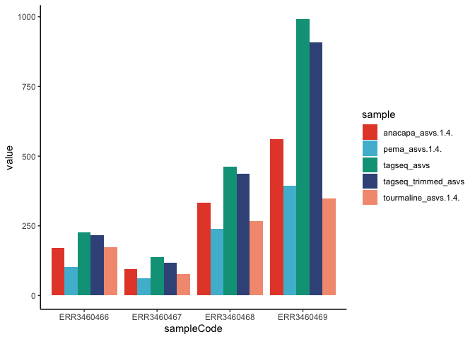
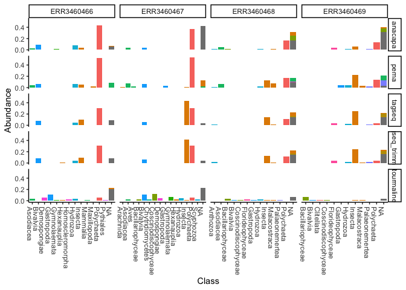

Testing\_bioinformatics\_pipelines
================
Saara Suominen
5/7/2021

-   [Testing bioinformatics pipelines for PacMAN and
    OBIS](#testing-bioinformatics-pipelines-for-pacman-and-obis)
    -   [Samples](#samples)
    -   [Pipelines](#pipelines)
-   [Downloading data to the phyloseq
    format](#downloading-data-to-the-phyloseq-format)
    -   [PEMA](#pema)
    -   [Tourmaline](#tourmaline)
    -   [ANACAPA](#anacapa)
    -   [Tagseq](#tagseq)
    -   [Tagseq with trimming](#tagseq-with-trimming)
-   [Comparing outputs of pipelines](#comparing-outputs-of-pipelines)
    -   [Number of reads retained](#number-of-reads-retained)
    -   [Number of ASVs in each sample](#number-of-asvs-in-each-sample)
    -   [Taxonomic classification](#taxonomic-classification)
    -   [Taxonomic composition](#taxonomic-composition)

# Testing bioinformatics pipelines for PacMAN and OBIS

In this document we are testing the output of publicly available
bioinformatics pipelines, to see how well they compare to each other.

## Samples

The test samples are real samples received from the ARMS project. The
results of these samples are
[published](https://www.frontiersin.org/articles/10.3389/fmars.2020.572680/full),
and the data is available at
[ENA](https://www.ebi.ac.uk/ena/browser/view/PRJEB33796).

The tested samples are:

| Sample title | Country | ID          | Preservative | Filter (um) | Fraction | MaterialSampleID                               | FastQENAcode | Sequence type |
|--------------|---------|-------------|--------------|-------------|----------|------------------------------------------------|--------------|---------------|
| ARMS\_14     | Greece  | SF40\_DMSO  | DMSO         | 40          | Sessile  | ARMS\_Crete\_1HERP\_180928-190128\_SF40\_DMSO  | ERR3460466   |               |
| ARMS\_15     | Greece  | SF40\_EtOH  | EtOH         | 40          | Sessile  | ARMS\_Crete\_1HERP\_180928-190128\_SF40\_EtOH  | ERR3460467   |               |
| ARMS\_16     | Greece  | MF500\_DMSO | DMSO         | 500         | Motile   | ARMS\_Crete\_1HERP\_180928-190128\_MF500\_DMSO | ERR3460468   |               |
| ARMS\_17     | Greece  | MF500\_EtOH | EtOH         | 500         | Motile   | ARMS\_Crete\_1HERP\_180928-190128\_MF500\_EtOH | ERR3460469   |               |

## Pipelines

We tested three different pipelines utilising the dada2 ASV inference
algorithms. In addition we received the analysed data used for the
publication from the ARMS team, analysed with the PEMA pipeline.

1.  [PEMA pipeline](https://github.com/hariszaf/pema) Pema is the
    pipeline developed and currently in use for the ARMS program. This
    makes it a well-standardized workflow, and used by a biodiversity
    community already. PEMA can be used for analysing 16S, 18S, ITS or
    COI metabarcoding data. In this case the analysis was likely:
    -   Preprocessing with trimmomatic and cutadapt
    -   ASV inference with Swarm
    -   Taxonomic assignment with RDPClassifier against the MIDORI
        database
2.  [Tourmaline](https://github.com/lukenoaa/tourmaline)  
    Tourmaline is an amplicon sequence processing workflow for Illumina
    sequence data that uses QIIME 2 and the software packages it wraps.
    Tourmaline manages commands, inputs, and outputs using the Snakemake
    workflow management system. Tourmaline is an alternative amplicon
    ‘pipeline’ to Banzai, which was developed for MBON (Marine
    Biodiversity Observation Network) and uses Swarm for OTU picking.
    Tourmaline provides rapid and reproducible workflows for Deblur and
    DADA2 and is extensible to other OTU picking algorithms. Currently
    supported Qiime2 commands:
    -   FASTQ sequence import using a manifest file, or use your
        pre-imported FASTQ qza file
    -   Denoising with DADA2 (paired-end and single-end) and Deblur
        (single-end)
    -   Feature classification (taxonomic assignment) with options:
        consensus BLAST, naive Bayes
    -   Feature filtering by taxonomy and by feature ID
    -   Interactive taxonomy barplot (qzv)
    -   De novo multiple sequence alignment with MAFFT (with masking)
        and tree building with Fasttree
    -   Tree visualization using Empress (qzv)
    -   Interactive alpha-rarefaction plot (qzv)
    -   Alpha diversity and alpha-rarefaction with choice of metrics
        (qzv)
    -   Beta diversity and beta group significance with choice of
        metrics (qzv)
    -   Principal coordinates plots with Emperor (qzv)
3.  [ANACAPA](https://github.com/limey-bean/Anacapa)  
    The Anacapa pipeline is largely based on the dada2 pipeline, which
    is gaining popularity. It uses sequence quality information for
    denoising data and inferring ASV tables. Anacapa combines this with
    some initial trimming, taxonomic inference as well as building a
    custom reference database. Anacapa consists of 4 modules:
    -   Building reference libraries using CRUX
    -   Running quality control (QC) and assigning Amplicon Sequence
        Variants (ASV) using Dada2 (Sequence QC and ASV Parsing),
    -   Assigning taxonomy using Bowtie 2 and a Bowtie 2 specific
        Bayesian Least Common Ancestor (BLCA) (Assignment) and
    -   Running exploratory data analysis and generating ecological
        diversity summary statistics for a set of samples using
        ranacapa.  
        All scripts and several prebuilt reference libraries are
        available and can be utilized on a local computer, and HPC
        server or a Singularity container. Anacapa is developed for the
        analysis of datasets of the CALeDNA project, making it suitable
        for the needs of PacMAN. The use of automated reference library
        generation, could be a useful tool for OBIS, updating taxonomic
        assignments, and allowing several different markers to be
        analysed in an otherwise identical manner. Currently available
        crux datasets are built solely on Genbank sequences, but it
        should be possible to add other datasets as well, like BOLD or
        MIDORI, for the COI gene.
4.  [Tagseq-Qiime2-Snakemake](https://github.com/shu251/tagseq-qiime2-snakemake)  
    Tagseq is a similar pipeline to tourmaline. It is based on snakemake
    and piping qiime2 commands for the analysis. However, tagseq
    includes also preprocessing steps and does not include extensive
    post-processing as the tourmaline pipeline.


For the taxonomic assignment of these files we used the
[MIDORI](http://www.reference-midori.info/) database downloaded in
January 2021 (GenBANK 241). Either in the qiime format or RDP classifier
format.

# Downloading data to the phyloseq format

We used the phyloseq package to work with the datasets in R. Each
pipeline had slightly different outputs, so each download was also
different.

## PEMA

``` r
ARMS=import_biom( '../../GeneticData/DataExamples/ARMS_data/Re_biom_format[5]/otu_table.from_txt_json.biom')

#Format tax table
taxmat=as.data.frame(tax_table(ARMS))
taxa=str_split(taxmat$Rank1, ";", simplify =T)
rownames(taxa)=rownames(taxmat)
colnames(taxa)=c("Kingdom","Phylum","Class","Order","Family","Genus","Species")

tax_table(ARMS)=tax_table(taxa)

#Add also sample data!
sample_data=read.xls("../../GeneticData/DataExamples/ARMS_data/Re_biom_format[5]/Data_Sheet_2.xls")
SAM=sample_data(sample_data)
sample_names(SAM)=sample_data$Sample.code
sample_data(ARMS)=SAM

#Subset to only the four samples analysed
ARMS=subset_samples(ARMS, Country=="Greece")

#Change sample names to ENA codes to match all datasets
sample_names(ARMS)=sample_data(ARMS)[,"FastQ.ENA.code"]$FastQ.ENA.code

ARMS
```

    ## phyloseq-class experiment-level object
    ## otu_table()   OTU Table:         [ 1310 taxa and 4 samples ]
    ## sample_data() Sample Data:       [ 4 samples by 9 sample variables ]
    ## tax_table()   Taxonomy Table:    [ 1310 taxa by 7 taxonomic ranks ]

``` r
ARMS2 <- prune_taxa(taxa_sums(ARMS) > 0, ARMS)
```

It looks like the PEMA biom has all taxonomic assignments (also those
with low confidence). I will look at the original table and filter with
confidence, to see how it matches my other classifications.

``` r
pemafull=read.xls("../../GeneticData/DataExamples/ARMS_data/Data_Sheet_2.xls", sheet=2)
#pemafull

#Only take the first 4 samples that I am working with
pema=pemafull[,-c(6:9)]
#remove those OTUs that are now 0
pema=pema[rowSums(pema[,c(2:5)])>0,]
conf=0.2

#Remove species names from those with confidence below 0.7?
pema[pema$confidence.estimate.6<conf, "species"]=""
#pema[pema$species!="",]
#39 rows which are above the threshold!
pema[pema$confidence.estimate.5<conf, "genus"]=""
#pema[pema$genus!="",]
#Also 39 rows
pema[pema$confidence.estimate.4<conf, "family"]=""
#pema[pema$family!="",]
#41 rows
pema[pema$confidence.estimate.3<conf, "order"]=""
#pema[pema$order!="",]
#46 rows
pema[pema$confidence.estimate.2<conf, "class"]=""
#pema[pema$class!="",]
#67 rows
pema[pema$confidence.estimate.1<conf, "phylum"]=""
#pema[pema$phylum!="",]
#128 rows
pema[pema$confidence.estimate<conf, "superkingdom"]=""
#pema[pema$superkingdom!="",]
#626 rows
```

## Tourmaline

``` r
#setwd("../../../github/bioinformatics/tourmaline/02-output-dada2-pe-unfiltered/")
#sammat=read.table("../00-data/metadata.tsv", sep='\t', header=T)

#tables found in the data slots of these file
otumat=read_qza("../bioinformatics/tourmaline/02-output-dada2-pe-unfiltered/00-table-repseqs/table.qza")
otumat=otumat$data
taxmat=read_qza("../bioinformatics/tourmaline/02-output-dada2-pe-unfiltered/01-taxonomy/taxonomy.qza")
taxmat=taxmat$data
tree=read_qza("../bioinformatics/tourmaline/02-output-dada2-pe-unfiltered/02-alignment-tree/rooted_tree.qza")
tree=tree$data

#Format taxmat
taxmat_mod=str_split(taxmat$Taxon, ";", simplify =T)
rownames(taxmat_mod)=taxmat$Feature.ID
colnames(taxmat_mod)=c("Kingdom","Phylum","Class","Order","Family","Genus","Species")

#Subset only the 4 first samples for the comparison
otumat=otumat[,c(1:4)]
OTU = otu_table(otumat, taxa_are_rows = TRUE)
#Subset only the 4 first samples for the comparison
TAX = tax_table(taxmat_mod)
sample_data=sample_data[c(1:4),]
SAM=sample_data(sample_data)
sample_names(SAM)=SAM$FastQ.ENA.code
tourmaline=phyloseq(OTU, TAX, SAM, tree)
tourmaline
```

    ## phyloseq-class experiment-level object
    ## otu_table()   OTU Table:         [ 1019 taxa and 4 samples ]
    ## sample_data() Sample Data:       [ 4 samples by 9 sample variables ]
    ## tax_table()   Taxonomy Table:    [ 1019 taxa by 7 taxonomic ranks ]
    ## phy_tree()    Phylogenetic Tree: [ 1019 tips and 1018 internal nodes ]

## ANACAPA

Ranacapa should have built-in functions to transform the anacapa output
to a phyloseq object. Unfortunately, at the time that I tried I couldn’t
get it to work, so I have done the download manually:

``` r
taxmat=read.table("../bioinformatics/Anacapa/Example_data/CO1_trial/CO1_test_run_Saara_4ARMS/CO1/CO1_taxonomy_tables/CO1_ASV_taxonomy_brief.txt", sep="\t", header=T)
otutable=taxmat[,c(2:5)]
rownames(otutable)=otutable$CO1_seq_number

#Format tax table
taxa=as.data.frame(str_split(taxmat$taxonomy, ";", simplify =T))
taxmat2=as.data.frame(apply(taxa,2,function(x) gsub(".*:","",x)))
colnames(taxmat2)=c("Kingdom","Phylum","Class","Order","Family","Genus","Species","extra")
rownames(taxmat2)=taxmat$CO1_seq_number
```

Take a look also at the anacapa tax tables at different confidence
levels:

``` r
#70% confidence
ana07=read.table("../bioinformatics/Anacapa/Example_data/CO1_trial/CO1_test_run_Saara_4ARMS/CO1/CO1_taxonomy_tables/Summary_by_percent_confidence/70/CO1_ASV_raw_taxonomy_70.txt", sep="\t", header=T)
anao7=as.data.frame(str_split(ana07$sum.taxonomy, ";", simplify =T))
rownames(anao7)=ana07$CO1_seq_number
colnames(anao7)=c("Kingdom","Phylum","Class","Order","Family","Genus","Species")


#50% confidence
ana05=read.table("../bioinformatics/Anacapa/Example_data/CO1_trial/CO1_test_run_Saara_4ARMS/CO1/CO1_taxonomy_tables/Summary_by_percent_confidence/50/CO1_ASV_raw_taxonomy_50.txt", sep="\t", header=T)
anao5=as.data.frame(str_split(ana05$sum.taxonomy, ";", simplify =T))
rownames(anao5)=ana05$CO1_seq_number
colnames(anao5)=c("Kingdom","Phylum","Class","Order","Family","Genus","Species")

#95% confidence
ana095=read.table("../bioinformatics/Anacapa/Example_data/CO1_trial/CO1_test_run_Saara_4ARMS/CO1/CO1_taxonomy_tables/Summary_by_percent_confidence/95/CO1_ASV_raw_taxonomy_95.txt", sep="\t", header=T)
ana95=as.data.frame(str_split(ana095$sum.taxonomy, ";", simplify =T))
rownames(ana95)=ana095$CO1_seq_number
colnames(ana95)=c("Kingdom","Phylum","Class","Order","Family","Genus","Species")
```

There are errors in the resulting taxmat: empty classifications shift
remaining classifications to the wrong columns. I made a loop to fix
this. There could be better way, but for this one time this works.

``` r
for(i in 1:dim(taxmat2)[1]) {
      
    if ((!grepl("p__", taxmat2[i,"Phylum"]))&taxmat2[i,"Phylum"]!="") {
        for(j in dim(taxmat2)[2]:3) {
              taxmat2[i,j]<-taxmat2[i,j-1]
        }  
      taxmat2[i,"Phylum"]=NA
   }

   if ((!grepl("c__", taxmat2[i,"Class"]))&taxmat2[i,"Class"]!="") {
        for(j in dim(taxmat2)[2]:4) {
             taxmat2[i,j]<-taxmat2[i,j-1]
        }  
      taxmat2[i,"Class"]=NA
   }
  
   if ((!grepl("o__", taxmat2[i,"Order"]))&taxmat2[i,"Order"]!="") {
        for(j in dim(taxmat2)[2]:5) {
             taxmat2[i,j]<-taxmat2[i,j-1]
        }  
      taxmat2[i,"Order"]=NA
   }
 
   if ((!grepl("f__", taxmat2[i,"Family"]))&taxmat2[i,"Family"]!="") {
        for(j in dim(taxmat2)[2]:6) {
             taxmat2[i,j]<-taxmat2[i,j-1]
        }  
      taxmat2[i,"Family"]=NA
   } 
    if ((!grepl("g__", taxmat2[i,"Genus"]))&taxmat2[i,"Genus"]!="") {
        for(j in dim(taxmat2)[2]:6) {
             taxmat2[i,j]<-taxmat2[i,j-1]
        }  
      taxmat2[i,"Genus"]=NA
   }
  }
```

Finally build the phyloseq object:

``` r
TAX=tax_table(taxmat2)
rownames(TAX)=rownames(taxmat2);colnames(TAX)=colnames(taxmat2)

OTU = otu_table(otutable, taxa_are_rows = TRUE)
taxa_names(OTU)=taxmat$CO1_seq_number
#Add the same sample names (here be careful, I manually checked these were right)
sample_names(OTU)=sample_data$FastQ.ENA.code

sample_names(OTU)=sample_names(SAM)[1:4]
anacapa=phyloseq(OTU, TAX, SAM)

anacapa
```

    ## phyloseq-class experiment-level object
    ## otu_table()   OTU Table:         [ 1753 taxa and 4 samples ]
    ## sample_data() Sample Data:       [ 4 samples by 9 sample variables ]
    ## tax_table()   Taxonomy Table:    [ 1753 taxa by 8 taxonomic ranks ]

``` r
#remove singletons (as there were many from the unpaired data, and I am not sure what this means)
anacapa<- prune_taxa(taxa_sums(anacapa) > 1, anacapa)
```

## Tagseq

``` r
otumat=read_qza("../bioinformatics/tagseq-qiime2-snakemake/scratch/qiime2/asv/CO1-Trial1-asv-table.qza")
otumat=otumat$data
taxmat=read_qza("../bioinformatics/tagseq-qiime2-snakemake/scratch/qiime2/asv/CO1-Trial1-tax_sklearn.qza")
taxmat=taxmat$data

#Format taxmat
taxmat_mod=str_split(taxmat$Taxon, ";", simplify =T)
rownames(taxmat_mod)=taxmat$Feature.ID
colnames(taxmat_mod)=c("Kingdom","Phylum","Class","Order","Family","Genus","Species")

OTU = otu_table(otumat, taxa_are_rows = TRUE)
TAX = tax_table(taxmat_mod)
#Again here, I know manually that the names are in the right order
sample_names(OTU)=sample_data$FastQ.ENA.code

tagseq=phyloseq::phyloseq(OTU, TAX, SAM)
tagseq
```

    ## phyloseq-class experiment-level object
    ## otu_table()   OTU Table:         [ 1538 taxa and 4 samples ]
    ## sample_data() Sample Data:       [ 4 samples by 9 sample variables ]
    ## tax_table()   Taxonomy Table:    [ 1538 taxa by 7 taxonomic ranks ]

## Tagseq with trimming

I also tried tagseq with different trimming parameters, as initially it
didn’t look like the trimming was doing much.

Original trimmomatic parameters: “LEADING:2”, “TRAILING:2”,
“SLIDINGWINDOW:4:2”, “MINLEN:25” Changed trimmomatic parameters:
“ILLUMINACLIP:NexteraPE-PE.fa:2:30:10:”, “LEADING:2”, “TRAILING:2”,
“SLIDINGWINDOW:4:20”, “MINLEN:25”

``` r
otumat=read_qza("../bioinformatics/tagseq-qiime2-snakemake/runs/trial2_trimming/scratch/qiime2/asv/CO1-Trial2_trimming-asv-table.qza")
otumat=otumat$data
taxmat=read_qza("../bioinformatics/tagseq-qiime2-snakemake/runs/trial2_trimming/scratch/qiime2/asv/CO1-Trial2_trimming-tax_sklearn.qza")
taxmat=taxmat$data

#Format taxmat
taxmat_mod=str_split(taxmat$Taxon, ";", simplify =T)
rownames(taxmat_mod)=taxmat$Feature.ID
colnames(taxmat_mod)=c("Kingdom","Phylum","Class","Order","Family","Genus","Species")

OTU = otu_table(otumat, taxa_are_rows = TRUE)
TAX = tax_table(taxmat_mod)
#Again here, I know manually that the names are in the right order
sample_names(OTU)=sample_data$FastQ.ENA.code

tagseq_trimmed=phyloseq::phyloseq(OTU, TAX, SAM)
tagseq_trimmed
```

    ## phyloseq-class experiment-level object
    ## otu_table()   OTU Table:         [ 1423 taxa and 4 samples ]
    ## sample_data() Sample Data:       [ 4 samples by 9 sample variables ]
    ## tax_table()   Taxonomy Table:    [ 1423 taxa by 7 taxonomic ranks ]

# Comparing outputs of pipelines

Now we can compare the outputs of all the pipelines.

## Number of reads retained

First of all how many reads are retained in each dataset

``` r
sampleSums=data.frame(sample_sums(anacapa),sample_sums(tourmaline),sample_sums(ARMS2), sample_sums(tagseq),sample_sums(tagseq_trimmed))
sampleSums$sampleCode=rownames(sampleSums)
ss2=pivot_longer(sampleSums,cols=-c(6), names_to="sample")
ggplot(ss2, aes(x=sampleCode,y=value, fill=sample))+
  geom_bar(stat='identity', position='dodge')+
  theme_classic()+
  scale_fill_npg()
```

<!-- -->

The reads are much lower for the ARMS dataset, as well as the tourmaline
dataset. With the ARMS dataset we will see that there are no
unclassified OTUs, so likely they have removed this data before we
received it. With tourmaline, it is likely that so many reads are
filtered because there are no preprocessing steps.

## Number of ASVs in each sample

Counts of ASVs in each sample. Here I count the ASVs that are not
singletons, because the anacapa output had many singletons analysed from
the output of the unmerged reads.

``` r
anacapa_asvs=colSums((otu_table(anacapa) != 0 & otu_table(anacapa)!=1))
tourmaline_asvs=colSums((otu_table(tourmaline) != 0 & otu_table(tourmaline)!=1))
pema_asvs=colSums((otu_table(ARMS2) != 0 & otu_table(ARMS2)!=1))
tagseq_asvs=colSums((otu_table(tagseq) != 0 & otu_table(tagseq)!=1))
tagseq_trimmed_asvs=colSums((otu_table(tagseq_trimmed) != 0 & otu_table(tagseq_trimmed)!=1)) 

asvSums=data.frame(anacapa_asvs[1:4],tourmaline_asvs[1:4],pema_asvs[1:4], tagseq_asvs, tagseq_trimmed_asvs)
asvSums$sampleCode=rownames(asvSums)
ss2=pivot_longer(asvSums,cols=-c(6), names_to="sample")
ggplot(ss2, aes(x=sampleCode,y=value, fill=sample))+
  geom_bar(stat='identity', position='dodge')+
  theme_classic()+
  scale_fill_npg()
```

<!-- -->

So despite the huge difference in amount of reads that were kept, it
looks like the amount of ASVs is much more closely connected across the
different pipelines. This is promising, but it can still be argued that
the more reads are kept, the better.

## Taxonomic classification

How many taxa were classified at each level for each pipeline?

``` r
#There are a few NA's that mix up the count in anacapa
tax_table(anacapa)[is.na(tax_table(anacapa))]=""

taxs=rbind(colSums(tax_table(ARMS2)!=""),
           colSums(pema[,c("superkingdom","phylum","class","order","family","genus","species")]!=""),
           colSums(tax_table(tourmaline)!=""),
           colSums(tax_table(anacapa)[,c(1:7)]!=""),
           colSums(anao5!=""),
           colSums(anao7!=""),
           colSums(ana95!=""),
           colSums(tax_table(tagseq)!=""),
           colSums(tax_table(tagseq_trimmed)!=""))

rownames(taxs)=c("Pema","Pema_filt","Tourmaline", "Anacapa","Ana_filt05","Ana_filt07","Ana_filt95","Tagseq","Tagseq_trimmed")

#Format and calculate also percentages of classifications:
taxs=as.data.frame(taxs)
perc=taxs/taxs[,1]
taxs$sample=rownames(taxs)
perc$sample=rownames(perc)
```

Total number of taxa classified at each taxonomic rank:

``` r
tx=pivot_longer(taxs, col=-c(8), names_to="Rank")
ggplot(tx, aes(x=Rank, y=value, fill=sample))+
  geom_bar(stat='identity', position='dodge')+
  theme_classic()+
  xlim(limits=c("Kingdom","Phylum","Class","Order","Family","Genus","Species"))+
  scale_fill_npg()
```

<!-- -->

Percentage of taxa classified at each taxonomic rank:

``` r
pc=pivot_longer(perc, col=-c(8), names_to="Rank")
ggplot(pc, aes(x=Rank, y=value, fill=sample))+
  geom_bar(stat='identity', position='dodge')+
  theme_classic()+
  xlim(limits=c("Kingdom","Phylum","Class","Order","Family","Genus","Species"))+
  scale_fill_npg()
```

<!-- -->

We can see that for PEMA the biom file contains all classifications,
irrespective of confidence. With a confidence threshold (used for
sklearn), the number gets much lower.

For anacapa, I am not sure what the main file contains. If we look at
the summary files though, we get to slightly lower classifications. The
classification method used in anacapa combines alignment based
classification with bowtie2 (100 hits), and finally Bayesian based last
common ancestor analysis (BLCA). Even with confidence values of 95% we
get a much higher classification (number of ASVs and % classified!) We
used the MIDORI library here as well (so not a CRUX-built reference
library). Anacapa does an LCA process (Least common ancestor) after
analysis, so this could be something to look into for the others as well
(however should not have an effect on the number of species classified.)

Use the tax\_table from the filtered datasets instead of the raw one for
taxonomic composition analysis.

For anacapa 95% confidence

``` r
#taxmat=tax_table(ana095)
taxa=as.data.frame(str_split(ana095$sum.taxonomy, ";", simplify =T))

taxmat=tax_table(taxa)
```

    ## Warning in .local(object): Coercing from data.frame class to character matrix 
    ## prior to building taxonomyTable. 
    ## This could introduce artifacts. 
    ## Check your taxonomyTable, or coerce to matrix manually.

``` r
colnames(taxmat)=c("Kingdom","Phylum","Class","Order","Family","Genus","Species")
rownames(taxmat)=ana095$CO1_seq_number

tax_table(anacapa)=taxmat
```

For pema confidence

``` r
rownames(pema)=pema$OTU
taxa=pema[,c("superkingdom","phylum","class","order","family","genus","species")]
taxmat=tax_table(taxa)
```

    ## Warning in .local(object): Coercing from data.frame class to character matrix 
    ## prior to building taxonomyTable. 
    ## This could introduce artifacts. 
    ## Check your taxonomyTable, or coerce to matrix manually.

``` r
colnames(taxmat)=c("Kingdom","Phylum","Class","Order","Family","Genus","Species")
rownames(taxmat)=rownames(taxa)

tax_table(ARMS2)=taxmat
```

## Taxonomic composition

First combine datasets to a table that can be plotted easily with ggplot

Add a differentiating factor value:

``` r
sample_data(anacapa)$pipeline="anacapa"
sample_data(tourmaline)$pipeline="tourmaline"
sample_data(ARMS2)$pipeline="pema"
sample_data(tagseq)$pipeline="tagseq"
sample_data(tagseq_trimmed)$pipeline="tagseq_trimmed"
```

Calculate relative abundance, as it will be easier to compare with such
different amounts of reads:

``` r
ana_rel=transform_sample_counts(anacapa, function(OTU) OTU/sum(OTU) )
tourma_rel=transform_sample_counts(tourmaline, function(OTU) OTU/sum(OTU) )
pema_rel=transform_sample_counts(ARMS2, function(OTU) OTU/sum(OTU) )
tagseq_rel=transform_sample_counts(tagseq, function(OTU) OTU/sum(OTU) )
tagseq_trimmed_rel=transform_sample_counts(tagseq_trimmed, function(OTU) OTU/sum(OTU) )
```

Format the data to a table

``` r
ana_melt=psmelt(ana_rel)#; ana_melt=ana_melt[,-21]
tourma_melt=psmelt(tourma_rel)
tagseq_melt=psmelt(tagseq_rel)
pema_melt=psmelt(pema_rel)
tagseq_trimmed_melt=psmelt(tagseq_trimmed_rel)

df_fig=rbind(pema_melt, tourma_melt, ana_melt, tagseq_melt, tagseq_trimmed_melt)
#Format table to harmonize taxa names, and empty values
df_fig[df_fig==""]=NA
df_fig[df_fig=="NA"]=NA
df_fig=as.data.frame(apply(df_fig, 2, function(y) gsub("k__|p__|c__|o__|f__|g__|s__", "", y)))
df_fig[,c("Kingdom","Phylum","Class","Order","Family","Genus","Species")]=as.data.frame(apply(df_fig[,c("Kingdom","Phylum","Class","Order","Family","Genus","Species")], 2, function(y) gsub("_.*", "", y)))
df_fig$Abundance=as.numeric(df_fig$Abundance)
```

Comparison at Phylum level:

``` r
df_fig %>% 
  group_by(Phylum) %>%
  filter(Abundance > 0.01) %>%
  ggplot(aes(Phylum, y=Abundance, fill=Phylum))+
  geom_bar(stat='identity')+
  theme_classic()+
  theme(axis.text.x = element_text(angle = -90, hjust = 0), legend.position = 'none')+
  facet_grid(pipeline~Sample, scales='free_x')
```

<!-- -->

Comparison at Class level:

``` r
#We remove first the low abundance Classes, so that the results is readable

df_fig %>% 
  group_by(Class) %>%
  filter(Abundance > 0.01) %>%
  ggplot(aes(x = Class, y = Abundance, fill=Phylum)) + 
  geom_bar(stat='identity')+
  theme_classic()+
  theme(axis.text.x = element_text(angle = -90, hjust = 0), legend.position = 'none')+
  facet_grid(pipeline~Sample, scales='free_x')
```

<!-- -->
Comparison at Order level:

``` r
df_fig %>% 
  group_by(Order) %>%
  filter(Abundance > 0.01) %>%
  ggplot(aes(x = Order, y = Abundance, fill=Phylum)) + 
  geom_bar(stat='identity')+
  theme_classic()+
  theme(axis.text.x = element_text(angle = -90, hjust = 0), legend.position = 'none')+
  facet_grid(pipeline~Sample, scales='free_x')
```

<!-- -->

Comparison at Family level:

``` r
df_fig %>% 
  group_by(Family) %>%
  filter(Abundance > 0.01) %>%
  ggplot(aes(x = Family, y = Abundance, fill=Phylum)) + 
  geom_bar(stat='identity')+
  theme_classic()+
  theme(axis.text.x = element_text(angle = -90, hjust = 0), legend.position = 'none')+
  facet_grid(pipeline~Sample, scales='free_x')
```

<!-- -->

Comparison at Genus level:

``` r
df_fig %>% 
  group_by(Genus) %>%
  filter(Abundance > 0.01) %>%
  ggplot(aes(x = Genus, y = Abundance, fill=Phylum)) + 
  geom_bar(stat='identity')+
  theme_classic()+
  theme(axis.text.x = element_text(angle = -90, hjust = 0), legend.position = 'none')+
  facet_grid(pipeline~Sample, scales='free_x')
```

<!-- -->

Comparison at Species level:

``` r
df_fig %>% 
  group_by(Species) %>%
  filter(Abundance > 0.01) %>%
  ggplot(aes(x = Species, y = Abundance, fill=Phylum)) + 
  geom_bar(stat='identity')+
  theme_classic()+
  theme(axis.text.x = element_text(angle = -90, hjust = 0), legend.position = 'none')+
  facet_grid(pipeline~Sample, scales='free_x')
```

<!-- -->
