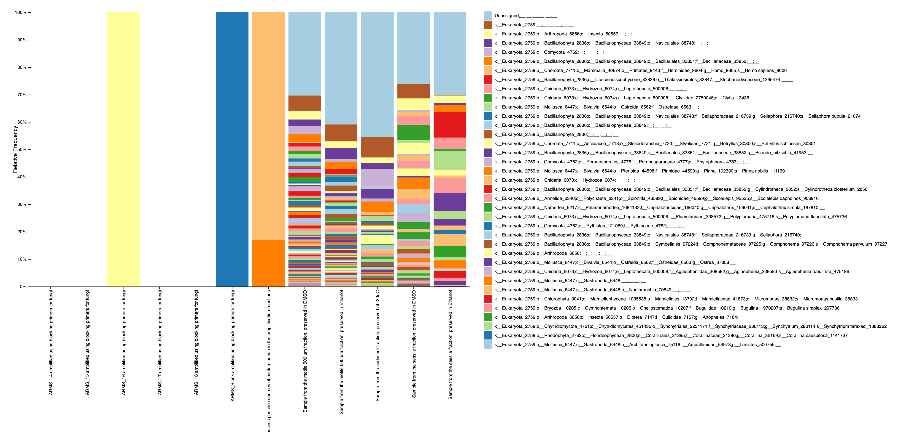

# Tourmaline

Pieter Provoost, 2 March 2020

These are my notes for installing and running the Tourmaline bioinformatics pipeline. This largely follows the official documentation at https://github.com/aomlomics/tourmaline

## Installation

First clone the Tourmaline repository, then start the docker container and mount the working directory as a volume under `/data`:

```bash
git clone git@github.com:aomlomics/tourmaline.git
docker run -v "$(pwd):/data" -it --name tourmaline aomlomics/tourmaline
```

To use the container again after exit:

```bash
docker start tourmaline
docker exec -it tourmaline /bin/bash
```

I installed vim to be able to edit files from the container:

```bash
apt-get update
apt-get install vim
```

## Working with the example data

### Setting up the test data

By mounting the Tourmaline repository in `/data`, the paths in the FASTQ manifest do not need to be modified:

```bash
(qiime2-2020.8) root@4f308ff87ace:/data# head tourmaline/00-data/manifest_pe.csv
sample-id,absolute-filepath,direction
SC56.50,/data/tourmaline/00-data/fastq/Sample_134716_R1.fastq.gz,forward
SC56.50,/data/tourmaline/00-data/fastq/Sample_134716_R2.fastq.gz,reverse
SC56.22,/data/tourmaline/00-data/fastq/Sample_134717_R1.fastq.gz,forward
SC56.22,/data/tourmaline/00-data/fastq/Sample_134717_R2.fastq.gz,reverse
SC54.50,/data/tourmaline/00-data/fastq/Sample_134718_R1.fastq.gz,forward
SC54.50,/data/tourmaline/00-data/fastq/Sample_134718_R2.fastq.gz,reverse
SC54.22,/data/tourmaline/00-data/fastq/Sample_134719_R1.fastq.gz,forward
SC54.22,/data/tourmaline/00-data/fastq/Sample_134719_R2.fastq.gz,reverse
SC53.50,/data/tourmaline/00-data/fastq/Sample_134720_R1.fastq.gz,forward
```

We also need to download and link the reference database and taxonomy files:

```bash
wget https://data.qiime2.org/2020.8/common/silva-138-99-seqs-515-806.qza
wget https://data.qiime2.org/2020.8/common/silva-138-99-tax-515-806.qza
ln -s silva-138-99-seqs-515-806.qza refseqs.qza
ln -s silva-138-99-tax-515-806.qza reftax.qza
```

### Running Snakemake

Run Snakemake:

```bash
snakemake dada2_pe_denoise
snakemake dada2_pe_taxonomy_unfiltered
snakemake dada2_pe_diversity_unfiltered
snakemake dada2_pe_report_unfiltered
```

## Working with our own data

### Creating a COI reference database

I started working on a notebook to create a reference database based on BOLD, inspired by https://forum.qiime2.org/t/building-a-coi-database-from-bold-references/16129. However, due to issues with the BOLD API, I will work with [MIDORI](http://www.reference-midori.info/) first.

### Importing the COI reference database

As we are working with tsv and fasta files from MIDORI, I added the files to `00-data` and made the following changes to `config.yaml`:

```
refseqs_fna: 00-data/MIDORI_UNIQ_GB241_CO1_QIIME.fasta
reftax_tsv: 00-data/MIDORI_UNIQ_GB241_CO1_QIIME.taxon
```

The output files have been left untouched:

```
refseqs_qza: 01-imported/refseqs.qza
reftax_qza: 01-imported/reftax.qza
```

Next, run `snakemake import_ref_seqs` and `snakemake import_ref_tax` to import sequences and taxonomy:

```bash
(qiime2-2020.8) root@2bd2f99e3eb5:/data/tourmaline# snakemake import_ref_seqs
Provided cores: 1
Rules claiming more threads will be scaled down.
Job counts:
	count	jobs
	1	import_ref_seqs
	1

rule import_ref_seqs:
    input: 00-data/MIDORI_UNIQ_GB241_CO1_QIIME.fasta
    output: 01-imported/refseqs.qza
    jobid: 0

Imported 00-data/MIDORI_UNIQ_GB241_CO1_QIIME.fasta as DNASequencesDirectoryFormat to 01-imported/refseqs.qza
Finished job 0.
1 of 1 steps (100%) done
(qiime2-2020.8) root@2bd2f99e3eb5:/data/tourmaline# snakemake import_ref_tax
Provided cores: 1
Rules claiming more threads will be scaled down.
Job counts:
	count	jobs
	1	import_ref_tax
	1

rule import_ref_tax:
    input: 00-data/MIDORI_UNIQ_GB241_CO1_QIIME.taxon
    output: 01-imported/reftax.qza
    jobid: 0

Imported 00-data/MIDORI_UNIQ_GB241_CO1_QIIME.taxon as HeaderlessTSVTaxonomyFormat to 01-imported/reftax.qza
Finished job 0.
1 of 1 steps (100%) done
```

### Importing data

I'm working with data from [Pilot study on the Autonomous Reef Monitoring Structures (ARMS) in Heraklion port (Crete, Greece) in the framework of ASSEMBLE+ project](https://www.ebi.ac.uk/ena/browser/view/PRJEB33796).

>  Pilot study on the Autonomous Reef Monitoring Structures (ARMS) in Heraklion port (Crete, Greece) in the framework of ASSEMBLE+ project.Samples were sequenced for the COI gene using mlCOIintF (Leray et al, 2014) and jgHCO2198 (Geller et al, 2014) primers. Samples were sequenced with the same primers but including blocking primers for the inhibition of fungi.

The COI fastq files for this study were download from the ENA portal and added to `00-data` as a subfolder named `ena-data`. Next we need to populate the `00-data/manifest_pe.csv` manifest file. This is based on the [TSV file](https://www.ebi.ac.uk/ena/portal/api/filereport?accession=PRJEB33796&result=read_run&fields=study_accession,sample_accession,experiment_accession,run_accession,tax_id,scientific_name,fastq_ftp,submitted_ftp,sra_ftp&format=tsv&download=true) from the ENA browser.

```
sample-id,absolute-filepath,direction
ERR3460466,/data/tourmaline/00-data/ena_files/ERR3460466/ARMS-COI-14_S135_L001_R1_001.fastq.gz,forward
ERR3460466,/data/tourmaline/00-data/ena_files/ERR3460466/ARMS-COI-14_S135_L001_R2_001.fastq.gz,reverse
ERR3460467,/data/tourmaline/00-data/ena_files/ERR3460467/ARMS-COI-15_S152_L001_R1_001.fastq.gz,forward
ERR3460467,/data/tourmaline/00-data/ena_files/ERR3460467/ARMS-COI-15_S152_L001_R2_001.fastq.gz,reverse
ERR3460468,/data/tourmaline/00-data/ena_files/ERR3460468/ARMS-COI-16_S169_L001_R1_001.fastq.gz,forward
ERR3460468,/data/tourmaline/00-data/ena_files/ERR3460468/ARMS-COI-16_S169_L001_R2_001.fastq.gz,reverse
ERR3460469,/data/tourmaline/00-data/ena_files/ERR3460469/ARMS-COI-17_S186_L001_R1_001.fastq.gz,forward
ERR3460469,/data/tourmaline/00-data/ena_files/ERR3460469/ARMS-COI-17_S186_L001_R2_001.fastq.gz,reverse
ERR3460470,/data/tourmaline/00-data/ena_files/ERR3460470/ARMS-COI-18_S203_L001_R1_001.fastq.gz,forward
ERR3460470,/data/tourmaline/00-data/ena_files/ERR3460470/ARMS-COI-18_S203_L001_R2_001.fastq.gz,reverse
ERR3460471,/data/tourmaline/00-data/ena_files/ERR3460471/ARMS-COI-Blank-1_S293_L001_R1_001.fastq.gz,forward
ERR3460471,/data/tourmaline/00-data/ena_files/ERR3460471/ARMS-COI-Blank-1_S293_L001_R2_001.fastq.gz,reverse
ERR3460472,/data/tourmaline/00-data/ena_files/ERR3460472/ARMS-COI-Blocking-14_S233_L001_R1_001.fastq.gz,forward
ERR3460472,/data/tourmaline/00-data/ena_files/ERR3460472/ARMS-COI-Blocking-14_S233_L001_R2_001.fastq.gz,reverse
ERR3460473,/data/tourmaline/00-data/ena_files/ERR3460473/ARMS-COI-Blocking-15_S314_L001_R1_001.fastq.gz,forward
ERR3460473,/data/tourmaline/00-data/ena_files/ERR3460473/ARMS-COI-Blocking-15_S314_L001_R2_001.fastq.gz,reverse
ERR3460474,/data/tourmaline/00-data/ena_files/ERR3460474/ARMS-COI-Blocking-16_S331_L001_R1_001.fastq.gz,forward
ERR3460474,/data/tourmaline/00-data/ena_files/ERR3460474/ARMS-COI-Blocking-16_S331_L001_R2_001.fastq.gz,reverse
ERR3460475,/data/tourmaline/00-data/ena_files/ERR3460475/ARMS-COI-Blocking-17_S363_L001_R1_001.fastq.gz,forward
ERR3460475,/data/tourmaline/00-data/ena_files/ERR3460475/ARMS-COI-Blocking-17_S363_L001_R2_001.fastq.gz,reverse
ERR3460476,/data/tourmaline/00-data/ena_files/ERR3460476/ARMS-COI-Blocking-18_S299_L001_R1_001.fastq.gz,forward
ERR3460476,/data/tourmaline/00-data/ena_files/ERR3460476/ARMS-COI-Blocking-18_S299_L001_R2_001.fastq.gz,reverse
ERR3460477,/data/tourmaline/00-data/ena_files/ERR3460477/ARMS-COI-Blocking-Blank_S107_L001_R1_001.fastq.gz,forward
ERR3460477,/data/tourmaline/00-data/ena_files/ERR3460477/ARMS-COI-Blocking-Blank_S107_L001_R2_001.fastq.gz,reverse
```

Metadata goes in `00data-metadata.tsv`. For now I'm keeping the metadata file minimal, but note that having only one column will cause `qiime feature-table summarize` to fail further down the line. Also, a column `regions` with multiple groups and multiple samples per group is required to make `dada2_pe_diversity_unfiltered` work.

```
sample_name	description	region
ERR3460466	Sample from the sessile fraction, preserved in DMSO	crete sessile
ERR3460467	Sample from the sessile fraction, preserved in Ethanol	crete sessile
ERR3460468	Sample from the motile 500 um fraction, preserved in DMSO	crete motile
ERR3460469	Sample from the motile 500 um fraction, preserved in Ethanol	crete motile
ERR3460470	Sample from the sediment fraction, preserved at -20oC	crete sediment
ERR3460471	Negative control (PCR blank) sample, i.e. sample with no nucleic acid template, in order to assess possible sources of contamination in the amplification reactions	crete blank
ERR3460472	ARMS_14 amplified using blocking primers for fungi	crete sessile
ERR3460473	ARMS_15 amplified using blocking primers for fungi	crete sessile
ERR3460474	ARMS_16 amplified using blocking primers for fungi	crete motile
ERR3460475	ARMS_17 amplified using blocking primers for fungi	crete motile
ERR3460476	ARMS_18 amplified using blocking primers for fungi	crete sediment
ERR3460477	ARMS_Blank amplified using blocking primers for fungi	crete blank
```

Next, import the paired-end sequences:

```bash
(qiime2-2020.8) root@2bd2f99e3eb5:/data/tourmaline# snakemake import_fastq_demux_pe
Provided cores: 1
Rules claiming more threads will be scaled down.
Job counts:
	count	jobs
	1	import_fastq_demux_pe
	1

rule import_fastq_demux_pe:
    input: 00-data/manifest_pe.csv
    output: 01-imported/fastq_pe.qza
    jobid: 0

Imported 00-data/manifest_pe.csv as PairedEndFastqManifestPhred33 to 01-imported/fastq_pe.qza
Finished job 0.
1 of 1 steps (100%) done
```

### Running the pipeline

#### Denoising

```bash
(qiime2-2020.8) root@2bd2f99e3eb5:/data/tourmaline# snakemake dada2_pe_denoise
Provided cores: 1
Rules claiming more threads will be scaled down.
Job counts:
	count	jobs
	1	dada2_pe_denoise
	1	denoise_dada2_pe
	1	describe_fastq_counts
	1	repseqs_detect_amplicon_locus
	1	repseqs_lengths
	1	repseqs_lengths_describe
	1	summarize_biom_features
	1	summarize_biom_samples
	1	summarize_fastq_demux_pe
	1	summarize_feature_table
	1	unzip_fastq_summary
	1	unzip_repseqs_to_fasta
	1	unzip_table_to_biom
	1	visualize_repseqs
	14

rule denoise_dada2_pe:
    input: 01-imported/fastq_pe.qza
    output: 02-output-dada2-pe-unfiltered/00-table-repseqs/table.qza, 02-output-dada2-pe-unfiltered/00-table-repseqs/repseqs.qza, 02-output-dada2-pe-unfiltered/00-table-repseqs/dada2_stats.qza
    jobid: 11

Running external command line application(s). This may print messages to stdout and/or stderr.
The command(s) being run are below. These commands cannot be manually re-run as they will depend on temporary files that no longer exist.

Command: run_dada_paired.R /tmp/tmpz9d543ke/forward /tmp/tmpz9d543ke/reverse /tmp/tmpz9d543ke/output.tsv.biom /tmp/tmpz9d543ke/track.tsv /tmp/tmpz9d543ke/filt_f /tmp/tmpz9d543ke/filt_r 240 190 0 0 2.0 2.0 2 independent consensus 1.0 1 1000000

R version 3.5.1 (2018-07-02)
Loading required package: Rcpp
DADA2: 1.10.0 / Rcpp: 1.0.4.6 / RcppParallel: 5.0.0
1) Filtering ............
2) Learning Error Rates
105020400 total bases in 437585 reads from 12 samples will be used for learning the error rates.
83141150 total bases in 437585 reads from 12 samples will be used for learning the error rates.
3) Denoise samples ............
............
4) Remove chimeras (method = consensus)
6) Write output
Saved FeatureTable[Frequency] to: 02-output-dada2-pe-unfiltered/00-table-repseqs/table.qza
Saved FeatureData[Sequence] to: 02-output-dada2-pe-unfiltered/00-table-repseqs/repseqs.qza
Saved SampleData[DADA2Stats] to: 02-output-dada2-pe-unfiltered/00-table-repseqs/dada2_stats.qza
Finished job 11.
1 of 14 steps (7%) done

rule unzip_repseqs_to_fasta:
    input: 02-output-dada2-pe-unfiltered/00-table-repseqs/repseqs.qza
    output: 02-output-dada2-pe-unfiltered/00-table-repseqs/repseqs.fasta
    jobid: 10
    wildcards: method=dada2-pe, filter=unfiltered

Finished job 10.
2 of 14 steps (14%) done

rule summarize_fastq_demux_pe:
    input: 01-imported/fastq_pe.qza
    output: 01-imported/fastq_summary.qzv
    jobid: 6

Saved Visualization to: 01-imported/fastq_summary.qzv
Finished job 6.
3 of 14 steps (21%) done

rule unzip_table_to_biom:
    input: 02-output-dada2-pe-unfiltered/00-table-repseqs/table.qza
    output: 02-output-dada2-pe-unfiltered/00-table-repseqs/table.biom
    jobid: 9
    wildcards: method=dada2-pe, filter=unfiltered

Finished job 9.
4 of 14 steps (29%) done

rule repseqs_lengths:
    input: 02-output-dada2-pe-unfiltered/00-table-repseqs/repseqs.fasta
    output: 02-output-dada2-pe-unfiltered/00-table-repseqs/repseqs_lengths.txt
    jobid: 14
    wildcards: method=dada2-pe, filter=unfiltered

Finished job 14.
5 of 14 steps (36%) done

rule unzip_fastq_summary:
    input: 01-imported/fastq_summary.qzv
    output: 01-imported/fastq_counts.tsv
    jobid: 13

Finished job 13.
6 of 14 steps (43%) done

rule repseqs_detect_amplicon_locus:
    input: 02-output-dada2-pe-unfiltered/00-table-repseqs/repseqs.fasta
    output: 02-output-dada2-pe-unfiltered/00-table-repseqs/repseqs_amplicon_type.txt
    jobid: 3
    wildcards: method=dada2-pe, filter=unfiltered

Finished job 3.
7 of 14 steps (50%) done

rule visualize_repseqs:
    input: 02-output-dada2-pe-unfiltered/00-table-repseqs/repseqs.qza
    output: 02-output-dada2-pe-unfiltered/00-table-repseqs/repseqs.qzv
    jobid: 4
    wildcards: method=dada2-pe, filter=unfiltered

Saved Visualization to: 02-output-dada2-pe-unfiltered/00-table-repseqs/repseqs.qzv
Finished job 4.
8 of 14 steps (57%) done

rule summarize_biom_features:
    input: 02-output-dada2-pe-unfiltered/00-table-repseqs/table.biom
    output: 02-output-dada2-pe-unfiltered/00-table-repseqs/table_summary_features.txt
    jobid: 2
    wildcards: method=dada2-pe, filter=unfiltered

Finished job 2.
9 of 14 steps (64%) done

rule summarize_biom_samples:
    input: 02-output-dada2-pe-unfiltered/00-table-repseqs/table.biom
    output: 02-output-dada2-pe-unfiltered/00-table-repseqs/table_summary_samples.txt
    jobid: 1
    wildcards: method=dada2-pe, filter=unfiltered

Finished job 1.
10 of 14 steps (71%) done
```

Due to an issue with the metadata file, I had to restart snakemake to finish the last few jobs:

```bash
(qiime2-2020.8) root@2bd2f99e3eb5:/data/tourmaline# snakemake -R summarize_feature_table
Provided cores: 1
Rules claiming more threads will be scaled down.
Job counts:
	count	jobs
	1	dada2_pe_denoise
	1	repseqs_lengths_describe
	1	summarize_feature_table
	3

rule summarize_feature_table:
    input: 02-output-dada2-pe-unfiltered/00-table-repseqs/table.qza, 00-data/metadata.tsv
    output: 02-output-dada2-pe-unfiltered/00-table-repseqs/table.qzv
    jobid: 4
    wildcards: method=dada2-pe, filter=unfiltered

Saved Visualization to: 02-output-dada2-pe-unfiltered/00-table-repseqs/table.qzv
Finished job 4.
1 of 3 steps (33%) done

rule repseqs_lengths_describe:
    input: 02-output-dada2-pe-unfiltered/00-table-repseqs/repseqs_lengths.txt
    output: 02-output-dada2-pe-unfiltered/00-table-repseqs/repseqs_lengths_describe.md
    jobid: 7
    wildcards: method=dada2-pe, filter=unfiltered

Finished job 7.
2 of 3 steps (67%) done

localrule dada2_pe_denoise:
    input: 01-imported/fastq_summary.qzv, 01-imported/fastq_counts_describe.md, 02-output-dada2-pe-unfiltered/00-table-repseqs/table.qzv, 02-output-dada2-pe-unfiltered/00-table-repseqs/table_summary_samples.txt, 02-output-dada2-pe-unfiltered/00-table-repseqs/table_summary_features.txt, 02-output-dada2-pe-unfiltered/00-table-repseqs/repseqs.qzv, 02-output-dada2-pe-unfiltered/00-table-repseqs/repseqs_amplicon_type.txt, 02-output-dada2-pe-unfiltered/00-table-repseqs/repseqs_lengths_describe.md
    jobid: 0

Finished job 0.
3 of 3 steps (100%) done
```

#### Assigning taxonomy

```bash
(qiime2-2020.8) root@2bd2f99e3eb5:/data/tourmaline# snakemake dada2_pe_taxonomy_unfiltered
Provided cores: 1
Rules claiming more threads will be scaled down.
Job counts:
	count	jobs
	1	dada2_pe_taxonomy_unfiltered
	1	feature_classifier
	1	taxa_barplot
	1	unzip_taxonomy_to_tsv
	1	visualize_taxonomy
	5

rule feature_classifier:
    input: 01-imported/refseqs.qza, 01-imported/reftax.qza, 02-output-dada2-pe-unfiltered/00-table-repseqs/repseqs.qza
    output: 02-output-dada2-pe-unfiltered/01-taxonomy/taxonomy.qza
    jobid: 5
    wildcards: method=dada2-pe

classify_method: consensus-blast
Saved FeatureData[Taxonomy] to: 02-output-dada2-pe-unfiltered/01-taxonomy/taxonomy.qza
Finished job 5.
1 of 5 steps (20%) done

rule taxa_barplot:
    input: 02-output-dada2-pe-unfiltered/00-table-repseqs/table.qza, 02-output-dada2-pe-unfiltered/01-taxonomy/taxonomy.qza, 00-data/metadata.tsv
    output: 02-output-dada2-pe-unfiltered/01-taxonomy/taxa_barplot.qzv
    jobid: 1
    wildcards: method=dada2-pe, filter=unfiltered

Saved Visualization to: 02-output-dada2-pe-unfiltered/01-taxonomy/taxa_barplot.qzv
Finished job 1.
2 of 5 steps (40%) done

rule visualize_taxonomy:
    input: 02-output-dada2-pe-unfiltered/01-taxonomy/taxonomy.qza
    output: 02-output-dada2-pe-unfiltered/01-taxonomy/taxonomy.qzv
    jobid: 2
    wildcards: method=dada2-pe, filter=unfiltered

Saved Visualization to: 02-output-dada2-pe-unfiltered/01-taxonomy/taxonomy.qzv
Finished job 2.
3 of 5 steps (60%) done

rule unzip_taxonomy_to_tsv:
    input: 02-output-dada2-pe-unfiltered/01-taxonomy/taxonomy.qza
    output: 02-output-dada2-pe-unfiltered/01-taxonomy/taxonomy.tsv
    jobid: 3
    wildcards: method=dada2-pe, filter=unfiltered

Finished job 3.
4 of 5 steps (80%) done

localrule dada2_pe_taxonomy_unfiltered:
    input: 02-output-dada2-pe-unfiltered/01-taxonomy/taxonomy.tsv, 02-output-dada2-pe-unfiltered/01-taxonomy/taxonomy.qzv, 02-output-dada2-pe-unfiltered/01-taxonomy/taxa_barplot.qzv
    jobid: 0

Finished job 0.
5 of 5 steps (100%) done
```

#### Phylogenetic tree, diversity analyses

```bash
qiime2-2020.8) root@2bd2f99e3eb5:/data/tourmaline# snakemake dada2_pe_diversity_unfiltered
Provided cores: 1
Rules claiming more threads will be scaled down.
Job counts:
	count	jobs
	1	alignment_gaps_describe
	1	dada2_pe_diversity_unfiltered
	4	diversity_alpha_group_significance
	1	diversity_alpha_rarefaction
	4	diversity_beta_group_significance
	1	diversity_core_metrics_phylogenetic
	1	visualize_tree
	13

rule diversity_core_metrics_phylogenetic:
    input: 02-output-dada2-pe-unfiltered/00-table-repseqs/table.qza, 02-output-dada2-pe-unfiltered/02-alignment-tree/rooted_tree.qza, 00-data/metadata.tsv
    output: 02-output-dada2-pe-unfiltered/03-alpha-diversity/rarefied_table.qza, 02-output-dada2-pe-unfiltered/03-alpha-diversity/faith_pd_vector.qza, 02-output-dada2-pe-unfiltered/03-alpha-diversity/observed_features_vector.qza, 02-output-dada2-pe-unfiltered/03-alpha-diversity/shannon_vector.qza, 02-output-dada2-pe-unfiltered/03-alpha-diversity/evenness_vector.qza, 02-output-dada2-pe-unfiltered/04-beta-diversity/unweighted_unifrac_distance_matrix.qza, 02-output-dada2-pe-unfiltered/04-beta-diversity/weighted_unifrac_distance_matrix.qza, 02-output-dada2-pe-unfiltered/04-beta-diversity/jaccard_distance_matrix.qza, 02-output-dada2-pe-unfiltered/04-beta-diversity/bray_curtis_distance_matrix.qza, 02-output-dada2-pe-unfiltered/04-beta-diversity/unweighted_unifrac_pcoa_results.qza, 02-output-dada2-pe-unfiltered/04-beta-diversity/weighted_unifrac_pcoa_results.qza, 02-output-dada2-pe-unfiltered/04-beta-diversity/jaccard_pcoa_results.qza, 02-output-dada2-pe-unfiltered/04-beta-diversity/bray_curtis_pcoa_results.qza, 02-output-dada2-pe-unfiltered/04-beta-diversity/unweighted_unifrac_emperor.qzv, 02-output-dada2-pe-unfiltered/04-beta-diversity/weighted_unifrac_emperor.qzv, 02-output-dada2-pe-unfiltered/04-beta-diversity/jaccard_emperor.qzv, 02-output-dada2-pe-unfiltered/04-beta-diversity/bray_curtis_emperor.qzv
    jobid: 7
    wildcards: method=dada2-pe, filter=unfiltered

Saved FeatureTable[Frequency] to: 02-output-dada2-pe-unfiltered/03-alpha-diversity/rarefied_table.qza
Saved SampleData[AlphaDiversity] to: 02-output-dada2-pe-unfiltered/03-alpha-diversity/faith_pd_vector.qza
Saved SampleData[AlphaDiversity] to: 02-output-dada2-pe-unfiltered/03-alpha-diversity/observed_features_vector.qza
Saved SampleData[AlphaDiversity] to: 02-output-dada2-pe-unfiltered/03-alpha-diversity/shannon_vector.qza
Saved SampleData[AlphaDiversity] to: 02-output-dada2-pe-unfiltered/03-alpha-diversity/evenness_vector.qza
Saved DistanceMatrix to: 02-output-dada2-pe-unfiltered/04-beta-diversity/unweighted_unifrac_distance_matrix.qza
Saved DistanceMatrix to: 02-output-dada2-pe-unfiltered/04-beta-diversity/weighted_unifrac_distance_matrix.qza
Saved DistanceMatrix to: 02-output-dada2-pe-unfiltered/04-beta-diversity/jaccard_distance_matrix.qza
Saved DistanceMatrix to: 02-output-dada2-pe-unfiltered/04-beta-diversity/bray_curtis_distance_matrix.qza
Saved PCoAResults to: 02-output-dada2-pe-unfiltered/04-beta-diversity/unweighted_unifrac_pcoa_results.qza
Saved PCoAResults to: 02-output-dada2-pe-unfiltered/04-beta-diversity/weighted_unifrac_pcoa_results.qza
Saved PCoAResults to: 02-output-dada2-pe-unfiltered/04-beta-diversity/jaccard_pcoa_results.qza
Saved PCoAResults to: 02-output-dada2-pe-unfiltered/04-beta-diversity/bray_curtis_pcoa_results.qza
Saved Visualization to: 02-output-dada2-pe-unfiltered/04-beta-diversity/unweighted_unifrac_emperor.qzv
Saved Visualization to: 02-output-dada2-pe-unfiltered/04-beta-diversity/weighted_unifrac_emperor.qzv
Saved Visualization to: 02-output-dada2-pe-unfiltered/04-beta-diversity/jaccard_emperor.qzv
Saved Visualization to: 02-output-dada2-pe-unfiltered/04-beta-diversity/bray_curtis_emperor.qzv
Finished job 7.
1 of 13 steps (8%) done

rule visualize_tree:
    input: 02-output-dada2-pe-unfiltered/02-alignment-tree/rooted_tree.qza, 02-output-dada2-pe-unfiltered/00-table-repseqs/table.qza, 00-data/metadata.tsv, 02-output-dada2-pe-unfiltered/01-taxonomy/taxonomy.qza, 02-output-dada2-pe-unfiltered/02-alignment-tree/outliers.qza
    output: 02-output-dada2-pe-unfiltered/02-alignment-tree/rooted_tree.qzv
    jobid: 11
    wildcards: method=dada2-pe, filter=unfiltered

Saved Visualization to: 02-output-dada2-pe-unfiltered/02-alignment-tree/rooted_tree.qzv
Finished job 11.
2 of 13 steps (15%) done

rule diversity_alpha_rarefaction:
    input: 02-output-dada2-pe-unfiltered/00-table-repseqs/table.qza, 02-output-dada2-pe-unfiltered/02-alignment-tree/rooted_tree.qza, 00-data/metadata.tsv
    output: 02-output-dada2-pe-unfiltered/03-alpha-diversity/alpha_rarefaction.qzv
    jobid: 2
    wildcards: method=dada2-pe, filter=unfiltered

Saved Visualization to: 02-output-dada2-pe-unfiltered/03-alpha-diversity/alpha_rarefaction.qzv
Finished job 2.
3 of 13 steps (23%) done

rule diversity_beta_group_significance:
    input: 02-output-dada2-pe-unfiltered/04-beta-diversity/unweighted_unifrac_distance_matrix.qza, 00-data/metadata.tsv
    output: 02-output-dada2-pe-unfiltered/04-beta-diversity/unweighted_unifrac_group_significance.qzv
    jobid: 14
    wildcards: method=dada2-pe, filter=unfiltered, metric=unweighted_unifrac

Saved Visualization to: 02-output-dada2-pe-unfiltered/04-beta-diversity/unweighted_unifrac_group_significance.qzv
Finished job 14.
4 of 13 steps (31%) done

rule diversity_beta_group_significance:
    input: 02-output-dada2-pe-unfiltered/04-beta-diversity/weighted_unifrac_distance_matrix.qza, 00-data/metadata.tsv
    output: 02-output-dada2-pe-unfiltered/04-beta-diversity/weighted_unifrac_group_significance.qzv
    jobid: 9
    wildcards: method=dada2-pe, filter=unfiltered, metric=weighted_unifrac

Saved Visualization to: 02-output-dada2-pe-unfiltered/04-beta-diversity/weighted_unifrac_group_significance.qzv
Finished job 9.
5 of 13 steps (38%) done

rule diversity_alpha_group_significance:
    input: 02-output-dada2-pe-unfiltered/03-alpha-diversity/shannon_vector.qza, 00-data/metadata.tsv
    output: 02-output-dada2-pe-unfiltered/03-alpha-diversity/shannon_group_significance.qzv
    jobid: 13
    wildcards: method=dada2-pe, filter=unfiltered, metric=shannon

Saved Visualization to: 02-output-dada2-pe-unfiltered/03-alpha-diversity/shannon_group_significance.qzv
Finished job 13.
6 of 13 steps (46%) done

rule diversity_alpha_group_significance:
    input: 02-output-dada2-pe-unfiltered/03-alpha-diversity/evenness_vector.qza, 00-data/metadata.tsv
    output: 02-output-dada2-pe-unfiltered/03-alpha-diversity/evenness_group_significance.qzv
    jobid: 5
    wildcards: method=dada2-pe, filter=unfiltered, metric=evenness

Saved Visualization to: 02-output-dada2-pe-unfiltered/03-alpha-diversity/evenness_group_significance.qzv
Finished job 5.
7 of 13 steps (54%) done

rule diversity_alpha_group_significance:
    input: 02-output-dada2-pe-unfiltered/03-alpha-diversity/faith_pd_vector.qza, 00-data/metadata.tsv
    output: 02-output-dada2-pe-unfiltered/03-alpha-diversity/faith_pd_group_significance.qzv
    jobid: 8
    wildcards: method=dada2-pe, filter=unfiltered, metric=faith_pd

Saved Visualization to: 02-output-dada2-pe-unfiltered/03-alpha-diversity/faith_pd_group_significance.qzv
Finished job 8.
8 of 13 steps (62%) done

rule diversity_beta_group_significance:
    input: 02-output-dada2-pe-unfiltered/04-beta-diversity/bray_curtis_distance_matrix.qza, 00-data/metadata.tsv
    output: 02-output-dada2-pe-unfiltered/04-beta-diversity/bray_curtis_group_significance.qzv
    jobid: 1
    wildcards: method=dada2-pe, filter=unfiltered, metric=bray_curtis

Saved Visualization to: 02-output-dada2-pe-unfiltered/04-beta-diversity/bray_curtis_group_significance.qzv
Finished job 1.
9 of 13 steps (69%) done

rule diversity_beta_group_significance:
    input: 02-output-dada2-pe-unfiltered/04-beta-diversity/jaccard_distance_matrix.qza, 00-data/metadata.tsv
    output: 02-output-dada2-pe-unfiltered/04-beta-diversity/jaccard_group_significance.qzv
    jobid: 4
    wildcards: method=dada2-pe, filter=unfiltered, metric=jaccard

Saved Visualization to: 02-output-dada2-pe-unfiltered/04-beta-diversity/jaccard_group_significance.qzv
Finished job 4.
10 of 13 steps (77%) done

rule diversity_alpha_group_significance:
    input: 02-output-dada2-pe-unfiltered/03-alpha-diversity/observed_features_vector.qza, 00-data/metadata.tsv
    output: 02-output-dada2-pe-unfiltered/03-alpha-diversity/observed_features_group_significance.qzv
    jobid: 10
    wildcards: method=dada2-pe, filter=unfiltered, metric=observed_features

Saved Visualization to: 02-output-dada2-pe-unfiltered/03-alpha-diversity/observed_features_group_significance.qzv
Finished job 10.
11 of 13 steps (85%) done

rule alignment_gaps_describe:
    input: 02-output-dada2-pe-unfiltered/02-alignment-tree/aligned_repseqs_gaps.txt
    output: 02-output-dada2-pe-unfiltered/02-alignment-tree/aligned_repseqs_gaps_describe.md
    jobid: 3
    wildcards: method=dada2-pe, filter=unfiltered

Finished job 3.
12 of 13 steps (92%) done

localrule dada2_pe_diversity_unfiltered:
    input: 02-output-dada2-pe-unfiltered/02-alignment-tree/rooted_tree.qzv, 02-output-dada2-pe-unfiltered/02-alignment-tree/aligned_repseqs_gaps_describe.md, 02-output-dada2-pe-unfiltered/02-alignment-tree/repseqs_properties.pdf, 02-output-dada2-pe-unfiltered/02-alignment-tree/repseqs_to_filter_outliers.tsv, 02-output-dada2-pe-unfiltered/02-alignment-tree/repseqs_to_filter_unassigned.tsv, 02-output-dada2-pe-unfiltered/03-alpha-diversity/alpha_rarefaction.qzv, 02-output-dada2-pe-unfiltered/03-alpha-diversity/faith_pd_group_significance.qzv, 02-output-dada2-pe-unfiltered/03-alpha-diversity/observed_features_group_significance.qzv, 02-output-dada2-pe-unfiltered/03-alpha-diversity/shannon_group_significance.qzv, 02-output-dada2-pe-unfiltered/03-alpha-diversity/evenness_group_significance.qzv, 02-output-dada2-pe-unfiltered/04-beta-diversity/bray_curtis_emperor.qzv, 02-output-dada2-pe-unfiltered/04-beta-diversity/bray_curtis_group_significance.qzv, 02-output-dada2-pe-unfiltered/04-beta-diversity/jaccard_emperor.qzv, 02-output-dada2-pe-unfiltered/04-beta-diversity/jaccard_group_significance.qzv, 02-output-dada2-pe-unfiltered/04-beta-diversity/unweighted_unifrac_emperor.qzv, 02-output-dada2-pe-unfiltered/04-beta-diversity/unweighted_unifrac_group_significance.qzv, 02-output-dada2-pe-unfiltered/04-beta-diversity/weighted_unifrac_emperor.qzv, 02-output-dada2-pe-unfiltered/04-beta-diversity/weighted_unifrac_group_significance.qzv
    jobid: 0

Finished job 0.
13 of 13 steps (100%) done
```

#### Reports

```bash
(qiime2-2020.8) root@2bd2f99e3eb5:/data/tourmaline# snakemake dada2_pe_report_unfiltered
Provided cores: 1
Rules claiming more threads will be scaled down.
Job counts:
	count	jobs
	1	dada2_pe_report_unfiltered
	1	generate_report_html
	1	generate_report_md
	1	summarize_feature_table
	1	summarize_metadata
	1	taxa_barplot
	6

rule taxa_barplot:
    input: 02-output-dada2-pe-unfiltered/00-table-repseqs/table.qza, 02-output-dada2-pe-unfiltered/01-taxonomy/taxonomy.qza, 00-data/metadata.tsv
    output: 02-output-dada2-pe-unfiltered/01-taxonomy/taxa_barplot.qzv
    jobid: 15
    wildcards: method=dada2-pe, filter=unfiltered

Saved Visualization to: 02-output-dada2-pe-unfiltered/01-taxonomy/taxa_barplot.qzv
Finished job 15.
1 of 6 steps (17%) done

rule summarize_feature_table:
    input: 02-output-dada2-pe-unfiltered/00-table-repseqs/table.qza, 00-data/metadata.tsv
    output: 02-output-dada2-pe-unfiltered/00-table-repseqs/table.qzv
    jobid: 24
    wildcards: method=dada2-pe, filter=unfiltered

Saved Visualization to: 02-output-dada2-pe-unfiltered/00-table-repseqs/table.qzv
Finished job 24.
2 of 6 steps (33%) done

rule summarize_metadata:
    input: 00-data/metadata.tsv
    output: 03-reports/metadata_summary.md
    jobid: 7

Finished job 7.
3 of 6 steps (50%) done

rule generate_report_md:
    input: config.yaml, 03-reports/metadata_summary.md, 01-imported/fastq_counts_describe.md, 02-output-dada2-pe-unfiltered/00-table-repseqs/repseqs_amplicon_type.txt, 02-output-dada2-pe-unfiltered/02-alignment-tree/repseqs_properties.tsv, 02-output-dada2-pe-unfiltered/02-alignment-tree/repseqs_properties.pdf, 02-output-dada2-pe-unfiltered/02-alignment-tree/rooted_tree.qzv, 02-output-dada2-pe-unfiltered/02-alignment-tree/repseqs_to_filter_outliers.tsv, 02-output-dada2-pe-unfiltered/02-alignment-tree/repseqs_to_filter_unassigned.tsv, 02-output-dada2-pe-unfiltered/00-table-repseqs/table_summary_samples.txt, 02-output-dada2-pe-unfiltered/00-table-repseqs/table_summary_features.txt, 01-imported/fastq_summary.qzv, 02-output-dada2-pe-unfiltered/00-table-repseqs/repseqs.qzv, 02-output-dada2-pe-unfiltered/01-taxonomy/taxonomy.tsv, 02-output-dada2-pe-unfiltered/01-taxonomy/taxonomy.qzv, 02-output-dada2-pe-unfiltered/00-table-repseqs/table.qzv, 02-output-dada2-pe-unfiltered/01-taxonomy/taxa_barplot.qzv, 02-output-dada2-pe-unfiltered/03-alpha-diversity/alpha_rarefaction.qzv, 02-output-dada2-pe-unfiltered/03-alpha-diversity/evenness_group_significance.qzv, 02-output-dada2-pe-unfiltered/03-alpha-diversity/faith_pd_group_significance.qzv, 02-output-dada2-pe-unfiltered/03-alpha-diversity/observed_features_group_significance.qzv, 02-output-dada2-pe-unfiltered/03-alpha-diversity/shannon_group_significance.qzv, 02-output-dada2-pe-unfiltered/04-beta-diversity/bray_curtis_emperor.qzv, 02-output-dada2-pe-unfiltered/04-beta-diversity/bray_curtis_group_significance.qzv, 02-output-dada2-pe-unfiltered/04-beta-diversity/jaccard_emperor.qzv, 02-output-dada2-pe-unfiltered/04-beta-diversity/jaccard_group_significance.qzv, 02-output-dada2-pe-unfiltered/04-beta-diversity/weighted_unifrac_emperor.qzv, 02-output-dada2-pe-unfiltered/04-beta-diversity/weighted_unifrac_group_significance.qzv, 02-output-dada2-pe-unfiltered/04-beta-diversity/unweighted_unifrac_emperor.qzv, 02-output-dada2-pe-unfiltered/04-beta-diversity/unweighted_unifrac_group_significance.qzv
    output: 03-reports/report_dada2-pe_unfiltered.md
    jobid: 2
    wildcards: method=dada2-pe, filter=unfiltered

Finished job 2.
4 of 6 steps (67%) done

rule generate_report_html:
    input: 03-reports/report_dada2-pe_unfiltered.md
    output: 03-reports/report_dada2-pe_unfiltered.html
    jobid: 1
    wildcards: method=dada2-pe, filter=unfiltered

Finished job 1.
5 of 6 steps (83%) done

localrule dada2_pe_report_unfiltered:
    input: 03-reports/report_dada2-pe_unfiltered.html
    jobid: 0

Finished job 0.
6 of 6 steps (100%) done
```

### Preliminary results

#### Taxonomy barplot



